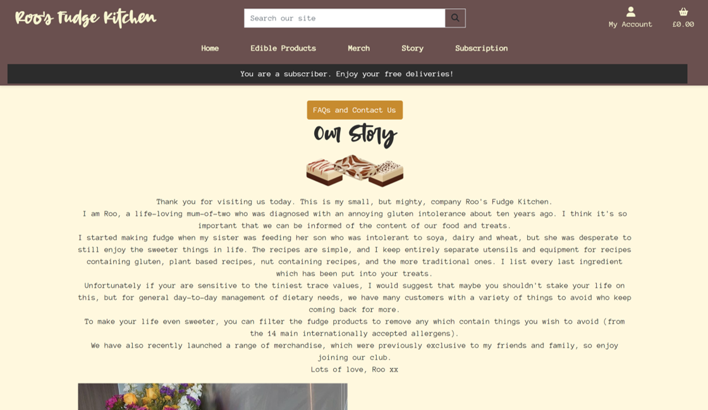

# Roo's Fudge Kitchen


## Project Rationale
A site for the e-commerce store selling homemade fudge. The site allows for products to be filtered according to allergen needs. Access the deployed site [here](https://roos-fudge-kitchen-9f7897dcad9e.herokuapp.com/) <br>
If you want to test the payment system, use these test card details:<br>
Card Number: 4242 4242 4242 4242<br>
Date: 04/25<br>
CVC: 242<br>
Postcode: 42424<br>


## Table of Contents
- [Project Rationale](#project-rationale)
- [Business and Customer Goals](#business-and-customer-goals)
- [UX/UI](#uxui)
  - [Wireframe Initial Ideas](#wireframe-initial-ideas)
  - [Colour Schemes](#colour-schemes)
  - [Fonts](#fonts)
  - [Design Development and Consistency in Site Theming](#design-development-and-consistency-in-site-theming)
  - [Structure Plane: Key Site Features](#structure-plane-key-site-features)
- [Data Relationships](#data-relationships)
  - [ERD](#erd)
  - [Explanation of Relationships](#explanation-of-relationships)
- [Marketing](#marketing)
  - [Business Model](#business-model)
  - [Core Business Intent](#core-business-intent)
  - [Search Engine Optimisation (SEO)](#search-engine-optimisation-seo)
    - [Keywords](#keywords)
    - [SiteMap](#sitemap)
    - [Robots](#robots)
  - [Social Media](#social-media)
    - [Facebook Business Page (Mockup)](#facebook-business-page-mockup)
    - [Instagram with Merchandise](#instagram-with-merchandise)
    - [Newsletters](#newsletters)
- [Agile Project Planning and Methodology](#agile-project-planning-and-methodology)
  - [Sprint 1: Objectives](#sprint-1-objectives)
  - [Sprint 2: Objectives](#sprint-2-objectives)
  - [Sprint 3: Objectives](#sprint-3-objectives)
  - [Sprint 4: Objectives](#sprint-4-objectives)
- [Manual Testing (Overview)](#manual-testing-overview)
  - [Testing of User Stories](#testing-of-user-stories)
  - [Bugs](#bugs)
    - [Resolved](#resolved)
    - [Unresolved](#unresolved)
- [Technologies Used](#technologies-used)
  - [Languages](#languages)
  - [Frameworks](#frameworks)
  - [Libraries and Packages](#libraries-and-packages)
  - [Programmes](#programmes)
- [References and Credits](#references-and-credits)
- [Procedures](#procedures)
  - [Prerequisites and Installs](#prerequisites-and-installs)
  - [Forking and Cloning](#forking-and-cloning)
  - [Heroku App Creation](#heroku-app-creation)
  - [AWS S3 Bucket Creation and Setup](#aws-s3-bucket-creation-and-setup)
  - [Integrating AWS S3 with Django](#integrating-aws-s3-with-django)
  - [Stripe Configuration](#stripe-configuration)


### Target audience:
This site is aimed at the market for luxury snacks. The site's main marketing drives to set it apart from similar companies include the availability of both 'traditional' fudge and plant-based products, the ability to filter all the products to exclude allergens, and the ability to purchase merchandise of their 'favourite' fudge supplier.<br>
Overall, the site targets discerning customers looking for gourmet fudge and a premium shopping experience.

## Business and customer goals
### User goals:
- Seamless, user friendly interface to enable browsing, filtering and purchasing of products with no unnecessary complexity.
- Allergen filtering to be able to remove undesired products quickly and easily.
- Payments are processed securely.
- Users receive order confirmations and are able to track their order, and contact the business for inquiries.

### Business goals:
- Establishment of a robust e-commerce platform to support and expand the market reach of the fudge company.
- Efficiently manage product listings, inquiries, and processing and tracking of orders.
- Engagement of customers through newsletters and social media, and the encouragement of brand loyalty with merchandise.
- Implementation of a subscription model with benefits to the customers and enhanced customer retention.
- Implementation of effective SEO strategies and social media presence in order to attract more customers and increase sales.

[Return to Top](#roos-fudge-kitchen)

### User stories and project goals
A full list of user stories and the associated acceptance criteria are detailed in a later section. The main over-arching goals for this project were:
- To create an e-commerce website to support a small, home-made, luxury fudge company
- For the website to be easy to use, and a positive experience for both the customer (who has many other options for how and where to spend their money) and the owner of the small business (who has far better things to do than fight with a 'difficult' website)

## UX/UI
### Wireframe initial ideas
| Page | Wireframes | Comments |
| --- | --- | --- |
|  Index/Home |   |  Page to provide links to fudge, merch, subscription and contact us |
| Fudge product list page |   | Neatly displayed across the page for comparison.  |
| Merchandise list page |   | Same layout as fudge page for consistency.  |
| Product detail page |  | Fudge products include further information regarding allergens. Product reviews could be added to these? |
| Subscription benefits page |   | Some nice images and a good list of benefits, with the ability to click a link to join the service.  |
| Basket page |   | Checkout page to look fairly similar, but with sign-in and Stripe element, and no ability to make further changes to the order.  |
| Order confirmation page |   | Again, a very similar look and feel to the basket and checkout pages  |
| Sign-up page |   | This is just an idea, but used the allauth in-built designs instead and personalised with CSS  |
| Our Story page | !  | An idea for how to layout images and text for this page.  |
| FAQs and Inquiries page |   | This will be accessed from 'Our Story' but only allow the inquiry form to be rendered for logged in users.  |
| Custom 404 page |   | A similar look will be used for a custom 500 page too.  |
| Administration dashboard 'home' |  | This page will lead to a number of administrative lists and ways to CRUD products and track orders and inquiries. Only accessible to users designated as 'staff'. |

### Colour schemes
Some initial ideas for the luxury fudge site were experimented with. 


The final choices and uses were as follows:<br>
**Background colour: #fff8dc (cornsilk)**<br>
Soft, warm tone to give a sense of sweetness and nostalgia.<br>
**Primary text colour: #2c2c2c (dark charcoal)**<br>
A suitable neutral colour to provide balance to the warm tones and excellent readability.<br>
**Header background colour and card background colour: #6b4f4f (deep taupe)**<br>
Rich and warm, contrasting with the cornsilk.<br>
**Header text colour: #f5f5cd (light khaki)**
Soft, pale yellow, to contrast with the header background and ensure readability.<br>
**Link colours and card titles: #daa520 (goldenrod)**<br>
Highlights important names and adds some vibrancy to the interactive features.<br>

### Fonts
**Terrapin, serif**
A classic, elegant font, with a sense of fun. Used for headers and slogans on the merchandise.
**Anonymous Pro, monospace**
Provides a modern, clean look and excellent readability.

### Design Development and consistency in site theming
The same colour schemes and fonts are used throughout the site. The use of the base.html file allowed for the same headers and navbar, giving the users a strong sense of familiarity whilst navigating around the site.
Toasts are used throughout the site to provide information regarding the basket and other user actions, including confirmation of any CRUD actions in the business dashboard. 
The merchandise and edible products are shown in 'cards' on the full product lists with key information, with further details and choices available when these are clicked on. This prevents overload of information and allows the customer to quickly browse products of interest.


[Return to Top](#roos-fudge-kitchen)

### Structure Plane: Key site features (all responsive)

| Page | Desktop | Tablet | Phone | Comments |
| --- | --- | --- | --- | --- |
| **Home** |  |  |  | - Home page nav top left (desktop only)<br> - Navbar either across (desktop) or burger menu (phone and tablet) <br> - Site search function for all product names and descriptions<br> - Easy link to accounts/profile<br> - Four site sections easy to reach – edible products, merch products, our-story and contact-us, and subscription |
| **Search results from search bar** |  |  |  | - Listed under ‘type’ <br> - Each result links to the product it found |
| **Edible products** |  |  |  | - Choice of viewing all products, plant-based or traditional <br> - Filter for allergens drops down and returns as required <br> - Symbols shown for allergens, as a short-hand, but other ways of interpreting the information are available.<br> - Price for 400g shown, but other weights available in the detail view <br> - Clear pictures and displayed on cards <br> - Guest products are shown with banners |
| **Edible product details** |  |  |  | - A full ingredients list <br> - Another list of the allergens <br> - A drop-down choice of weights and values <br> - Ability to increase/decrease the number required |
| **Merchandise products** |  |  |  | - Full variety of products can be seen. <br> - These can be further filtered using the navbar <br> - Detail and price shown on cards |
| **Merchandise product details** |  |  |  | - Price and description with larger, full image shown <br> - Alternative colours (if available) are shown and act as links to those products <br> - Choice of text in drop down menu, shown in the correct font when suggested. <br> - Ability to change the quantity required |
| **Basket** |  |  |  | - Key product information (name, image, amount, flavour and weight for edible, and text for merch) shown <br> - Ability to update the number of products or remove them altogether <br> - Options for whether to clear basket, keep shopping or proceed to checkout <br> - If basket is empty, only a 'keep shopping' option is given which returns to the homepage |
| **Login** |  |  |  | - Adapted template from allauth <br> - User receives a toast confirming their actions |
| **Sign-up** |  |  |  | - Adapted template from allauth <br> - User receieves a toast confirming their actions <br> - Email address is confirmed and user redirected back to site |
| Checkout |  |  |  | - Items are shown. <br> - Non-authenticated users are asked to login or register for an account, and are then directed back to this page. <br> - Email address from login is lready populated and cannot be edited. <br> - Customers fill out the information <br> - Customers who have previously made a purchase will have their address details pre-populated, but can alter these as required. <br> - Stripe payment completed on the same page. <br> - Option to return to the basket is given if customers realise they have made mistakes. |
| Checkout success |  |  |  | - Shown on the page and with a toast. <br> - Email is also generated. <br> - Message on page suggests that users check their spam folders if it does not show up in their inbox in a couple of minutes.<br> - Customers receive a unique order number for tracking purposes. |
| Profile |  |  |  | - Customers can see their address details, dietary preferences and allergen information. <br> - They can see details of previous orders and whether the most recent one has been dispatched. |
| Order details |   |   |  | - Full details, including the dispatch address, can be seen. |
| Edit profile |  |   |   | - They can opt to sign up for the newsletter  (or remove this if required) <br> - The can change the delivery address information and any dietary preferences |
| Story |  |   |   |  - Simple images and text <br> - Top links to FAQs and contact us <br> - Base links to fudge and merch |
| Contact us and FAQs |  |   |   | - Drop down boxes for the FAQs <br> - FAQs available if logged in <br> - Login and register for people who are not logged in <br> - Messages are sent  to the inquiry dashboard |
| Subscription |  |  |  | - Subscription benefits are listed. <br> - Authenticated users without a subscription can add it to their basket. <br> - Un-authenticated users are asked to sign-in or register. <br> - Authenticated users with an active subscription are recognised and prevented from adding it to their basket <br> - Subscription product can only be added once to the basket. |
| Store Management |  |  |  | - Store management requires a “staff” login, but can then be accessed easily from the profile. <br> - The main dashboard provides the options available.|
| Product CRUD |  |  |  | - Edible and merch products have full CRUD capability from here. <br> - Ingredients and allergen details, and any changes to the standard prices can be added for edible products. Linked products (with alternative colours), and choices of phrases can be added  |
| Order tracking |  |  |  | - The store manager can see the orders which have been placed. Dispatched orders display ‘greyed-out’. Individual products can be marked as ‘made’. This is a feature to help the management of a small business who make the products themselves (or maybe have a third party make the merch items). <br> - The list can be filtered to only show items requiring dispatch, edible items or merch items. Again, these are features which assist the running of the business (and therefore the customer experience of shopping at the site) |
| Subscription management |  |  |  | - Subscription products can be managed, subscribed users listed and key information to ensure any free samples are suitable for their dietary/allergen requirements can be seen. <br> - The admin has the ability to cancel subscriptions and a countdown is provided for how long each subscriber has left of their annual subscription. This would be cancelled manually by the Store Owner, either at the end of the year, or earlier if the subscriber requested. <br> - A list of subscriber email addresses is provided here, allowing ease of contact for promotional or instructional emails. <br> - Note about responsive behaviour: the table contains a lot of information and is required to horizontal scroll on smaller screen-sizes. This is a known bug. |
| Newsletter management |  |  |  | - A list of users who have opted into the newsletter can be seen on this page. This should always be checked before triggering any newsletter emails from the business.|
| Inquiries management |  |  |  | - All submitted customer inquires appear listed from newest to oldest. These can also be marked as resolved to allow management to quickly assess where to direct their attention.
 |


#### Future features
There are a number of future features which could be added, some of which were in the 'could' designation of the user stories, others of which were found in the development process:
- Automatic monthly billing for subscriptions, <br>
- Automatic cancellation at the end of the year, <br> 
- Different ‘levels’ of subscription and bonus discount code which could be sent to the subscribers
- Management of the content and sending of newsletter and subscription emails directly from the site rather than using a third party

[Return to Top](#roos-fudge-kitchen)

## Data relationships
### ERD


### Explanation of relationships
1. Users/Profile
- One-to-Many with OrderModel/Payments (users can submit multiple orders and payments)
- One-to-Many with Inquiries (users can submit multiple inquiries)
- One-to-One with Subscription (each user may have a subscription)
- One-to-Many with NewsLetterModel (each user could be subscribed to receive multiple newletters)

2. Inquiries
- Many-to-One with Users/Profile

3. Payments
- Many-to-One with Users/Profile 
- One-to-One with OrderModel (each order has a single payment associated with it)

4. OrderModel
- One-to-One with Payments
- Many-to-One with Users/Profile (multiple orders can be placed by one user)

5. SubscriptionModel
- One-to-One with Users/Profile

6. NewsletterModel
- Many-to-One with Users/Profile

7. ProductModel
The parent class of the Fudge, Merchandise and Subscription models. CommonProduct was formed to allow unique products to be listed and saved.

8. FudgeModel
- Many-to-One with PaymentModel (a required payment can include multiple fudge items)

9. MerchandiseModel
- Many-to-One with PaymentModel (a required payment can include multiple merchandise items)

## Marketing
### Business model
This site works on the principle of Business to Customer. The user is able to purchase the products directly from the business and have them shipped straight to them. A login is required to complete the purchase, but this has the advantage to the user that they can then track their order. There are further advantages and additional features available to registered users, newsletter subscribers and those who purchase an annual subscription.

### Core business intent
To provide a simple and satisfying shopping experience for customers, allowing them to easily find the products they want and to make selections and purchases without problems. 

### Search Engine Optimisation (SEO)
#### Keywords
The potential keywords from the pages were analysed. Some potential search terms from these were devised, and a few tested for web traffic as shown in the images. Key terms were optimised and added into the base.html meta tags in order to affect the whole site output.
 <br>
 <br>

#### SiteMap
A sitemap was created by entering the site's url into xml.sitemap.com. This provided a map of all the pages visible to search engines. This file was then downloaded and added to the project root directory.
#### Robots
A robots.txt file was created following the guidelines in [this page from conductor.com](https://www.conductor.com/academy/robotstxt/). This will ensure that the search engines focus on the pages with the most suitable and useful content for the customers.


[Return to Top](#roos-fudge-kitchen)

### Social media
#### Facebook business page (mockup)

Facebook business pages are used to allow followers to see and share up to date information about the brands that interest them. The page is used to inform about new products and promotions, place targeted advertising and to link users to the main product site.
#### Instagram with merchandise
Humorous merchandise and pictures with people and their bought products are encouraged in the delivery notes. The main aim of this is to generate interest in the brand and encourage people to visit the main page and make their own purchases.


### Newsletters
Users sign up with an email address. Those who do not opt out of marketing will receive emails detailing flavours of the month and other new and exciting products. 
This process is managed by MailChimp (where these promotional emails can easily be set up and managed from the lists held in the Store Management parts of the site), and site users who have not yet made a purchase can still create a login, which will sign them up to the newsletter.

[Return to Top](#roos-fudge-kitchen)

## Agile project planning and methodology
An initail collection of user stories were determined at the start. These were then analysed for prioritisation and  the first sprint planned in terms of goals.  <br>
Each sprint was conducted the extent to which the goals were met was analysed, the sprints assessed and any incomplete work's value reassessed as to where/whether it should be tackled in the future. <br>
Progress was documented using GitHub Projects, which made it easy to visually manage the work load.

### Full user stories and acceptance criteria
| User story  | MoSCoW |  Acceptance criteria  |  Story points  |
| ----------- | ----------- | ----------- | ----------- |
| As a **site visitor** I can **browse fudge products and merchandise without creating an account**, in order to **decide whether to purchase from the site**.      | Must       | - Access the wesbite's homepage <br> - Navigate to the products section <br> - View a list of available fudge products without needing to log in <br> - Click on individual product items to view more details |  5 <br> This requires both front and backend development for product displays and navigation. |
| As a **site-visitor**, I can **filter fudge products by plant-based or traditional and by allergens**, in order to **find products suitable for my dietary needs**.   | Should        | - Find filtering options prominently displayed on the fudge products page <br> - Select either plant-based or tradition for preferences <br> - Select allergens to exlclude from recipes <br> - See the available product list update dynamically based on the selected filter <br> - Be able to clear filters and return to full product list | 8 <br> This involves complex filtering logic on both front and backend, drawing in information from across a number of the Django apps. |
| As a **site-visitor**, I can **view the additional benefits of subscription plans**, in order to **allow informed decisions of the potential reasons to sign-up for this**.  | Should        | - Locate the subscription section of the website <br> - Read clear descriptions of the benefits offered to subscribers <br> - Understand the benefits of paid subscription compared to non-subscribers | 2 <br> Simple frontend development. |
| As a **member**, I can **select fudge sizes and packaging options**, in order **to customise my order**. | Should | - During the selection process allow different sizes to be chosen <br> - During the checkout process allow customisation of packaging. <br> - See the chosen options reflected in the order summary before purchase | 3 <br> Requires front and backend development for order customisation. |
| As a **member**, I can **checkout**, in order to **complete my purchase**. | Must | - Add desired items to the shopping basket <br> - Proceed to the checkout page with the same selected items <br> - Enter necessary shipping and payment information <br> - Receive a confirmation emssage upon successful completion of the order | 5 <br> Requires front and backend development for order processing |
| As a **member**, I can **make secure payments using Stripe**, in order to **ensure my payment information is safe**. | Must  | - Use a secure link to Stripe's payment services <br> - Enter payment details securely <br> - Receive confirmation of successful payment processing | 8 <br> Integration of the Stripe payment gateway including webhooks |
| As a **member**, I can **receive an order confirmation via email**, in order to **have a record of my purchase**. | Must | - Receive an email confirmation shortly after completing the purchase <br> - Email contains details of the items purchased, the amount spent, and the shipping address | 3 <br> Backend development for sending email notifications (initially just to the terminal) |
| As a **member**, I can **submit inquiries through a form**, in order to **get answers to questions not covered in the FAQs**. | Could | - Locate the contact form on the website <br> - Fill out the form with relevant details and questions <br> Submit the form and receive a confirmation message | 3 <br> Backend and front end development for the form and handling of submissions |
| As a **member**, I can **create an account to save my details**, in order to **checkout faster in the future**. | Must | - Access the registration page from the website's naviation menu <br> - Fill out the required fields such as email and password <br> - Receive a verification email email to activate the account | 3 <br> Backend development for user authentication and frontend for account creation |
| As a **member**, I can **log in to my account to view past orders and update my details**, in order to **manage my purchases and account information easily**. | Must | - Log in using registered credentials <br> - Access an 'account' page with past orders and relevant account information <br> - Be able to update personal details such as address information | 3 <br> Backend development for user authentication and frontend for account management |
| As a **member**, I can **receive promotional emails**, in order to **be informed about new flavours and special offers**. | Could | - Opt-in to receive promotional emails during account creation or account settings page <br> - Receive periodic emails about new flavours, special offers, and promotions | 5 <br> Backend development for email subscription feature |
| As a **member**, I can **have the site remember my dietary preferences**, in order **to automatically filter products for me**. | Could | - Set allergen preferences in the account settings <br> - See products filtered based on allergen preferences during browsing | 5 <br> Backend development required for storing and managing preferences |
| As a **member**, I can **purchase merchandise like mugs and coasters**, in order to **have branded items from my favourite fudge shop**. | Should | - Find merchandise products alongside fudge products <br>  - Add merchandise items to the shopping cart <br> - Proceed with the checkout process in the same manner as for fudge products | 3 <br> Frontend and backend development required for merchandise display and purchase |
| As a **subscribing customer**, I can **choose a subscription plan**, in order **to best fit my needs**. | Should | - Access the subscription page from the website's main menu <br> - Choose from available subscription plans <br> - Proceed with the subscription process, including payment | 5 <br> Frontend and backend development for subscription plan details and sign up processes |
| As a **subscribing customer**, I can **receive free delivery and monthly 'flavour of the month' samples**, in order to **enjoy my subscription benefits**. | Should | - Receive free delivery on all orders <br> - Have 'flavour of the month' samples auto-allocated to the business' work flow | 5 <br> Backend development required for handling subscription benefits |
| As a **subscribing customer**, I can **update or cancel my subscription**, in order to **have control over my subscription choices**. | Should | - Access the ability to cancel an existing subscription or update preferences | 5 <br> Backend development for subscription management |
| As a **subscribing customer**, I can **receive a monthly email about the 'flavour of the month' and other promotions**, in order to **stay informed about new and special offers**. | Could | - Same criteria as the non-subscribing member | 5 <br> Backend development for email subscription feature |
| As a **subscribing customer**, I can **set my allergen/dietary preferences for the 'guest flavour' samples**, in order to **ensure they are always suitable for me to consume**. | Should | - Set allergen and dietary preferences specific to the 'guest flavour' samples in the account settings <br> - Ensure the 'guest flavour' sample align with these preferences | 5 <br> Requires backend development for managing preferences |
| As a **subscribing customer**, I can **have my billing and shipping details remembered**, in order to **ensure smooth subscription renewals**. | Should | - Have billing and shipping details securely stored for recurring subscription payments <br> - Allow for these details to be easily updated as required | 3 <br> Backend development required for storing and managing user details |
| As a **site admin**, I can **add, update, or remove fudge flavours and merchandise from the site**, in order to **manage the products effectively**. | Must | - Access the admin dashboard with appropriate permissions <br> - Add new products with details such as flavour, descriptions, ingredients, pricing and images <br> - Update existing prodict information or remove products that are no longer available | 5 <br> Front and backend development for product management |
| As a **site admin**, I can **view and manage customer orders**, in order to **ensure timely processing and delivery**. | Must | - Access a list of all customer orders from the admin dashboard <br> - View order details including items purchased, total amount and customer information <br> - Manage orders by updating order status, tracking shipments and handling returns | 8 <br> Backend development for order management |
| As a **site admin**, I can **manage user accounts, including subscription details**, in order to **provide customer support and manage subscriptions**. | Must | - Access a list of all user accounts and subscription details <br> - Manage user accounts by updating account information, resetting passwords, and handling account-related issues <br> - Manage subscriptions by updating subscription preferences, renewing subscriptions, or cancelling subscriptions | 5 <br> Backend development for user and subscription management |
| As a **site admin**, I can **send out monthly promotional emails to subscribers**, in order to **engage with my customers and promote new flavours and offers**. | Should | - Access the email marketing platform from the admin dashboard <br> - Create and schedule monthly promotional emais containing information about new flavours, special offers and promotions <br> - Ensure that emails are sent to all subscribed users (who haven't opted out) | 5 <br> Backend development of email marketing feature |
| As a **site admin**, I can **access a user-friendly admin interface**, in order to **efficiently manage the site**. | Must | - Log in to the dashboard with secure credentials <br> - Prevent unauthorised access <br> - Navigate the admin interface easily with intuitive menus and options <br> - Access all necessary tools and features for managing the website effectively | 3 <br> Front and backend development to display as much of the backend administrative details as the business owner needs |
| As a **site admin**, I can **receive and respond to customer inquiries submitted through the website**, in order to **provide assistance and information as needed**. | Should | - Access the customer support section from the admin dashboard <br> - View incoming customer inquiries submitted through the website's contact form <br> - Respond to customer inquiries promptly and effectively | 3 <br> Backend development for handling inquiries |
| As a **site admin**, I can **implement and manage SEO strategies and tools on the website**, in order to **improve the site's visibility and ranking on search engines, thereby attracting more potential customers to our fudge products and increasing sales**. | Must | - Access SEO tools and settings <br> - Implement on-page strategies such as meta tags, keywords and content optimisation <br> - Create and maintain a social media presence | 5 <br> Backend development and ongoing management. Use of a variety of programmes and tools beyond django |

[Return to Top](#roos-fudge-kitchen)

### Sprint 1: Objectives

To set up a minimum viable product of an e-commerce site (MVP). Users are able to browse and select products for purchase, add them to a basket, be able to control the contents of that basket, allocate payment and receive a confirmation email. The site should be successfully deployed to Heroku and Stripe payments should show as successful test transactions. 

#### Definintion of done for Sprint 1:
A MVP site deployed to Heroku where customers can select and purchase products.

#### User stories covered in this sprint
- As a **site visitor** I can **browse fudge products and merchandise without creating an account** in order to **decide whether to purchase from the site**.
- As a **member**, I can **select fudge sizes and packaging options**, in order **to customise my order**.
- As a **member**, I can **check out**, in order to **complete my purchase**.
- As a **member**, I can **make secure payments using Stripe**, in order to **ensure my payment information is safe**.
- As a **member**, I can **receive an order confirmation via email**, in order to **have a record of my purchase**.
- As a **site admin**, I can **add, update, or remove fudge flavours and merchandise from the site**, in order to **manage the products effectively**.

#### Breakdown of the work goals to meet the objectives:
Goal 1: Set-up Django project, launch on Heroky and set-up basic homepage view. <br>
Goal 2: Set-up "EdibleProducts" and a basic view of a single product (including database links and AWS, and linking these to Heroku) <br>
Goal 3: Set-up checkout including views <br>
Goal 4: Set-up Stripe payments and link these (including the webhooks) to both the development site and the Heroku site <br>
Goal 5: Set-up account sign-up and sign-in views <br>
Goal 6: Set-up email confirmation of purchase (to run to the terminal) <br>
Goal 7: Basic CSS and JavaScript to ensure reasonable UI/UX <br>

#### Analysis of the sprint (and lessons learned):
There were some major issues with the time-boxing, in particular with linking the site effectively with Stripe. The goals were met, with the exception of one of the webhooks which is still suffering with a persistent bug relating to 'charges'. <br>
The webhook issue will require tackling in a future Sprint, but setting up the admin dashboard capabilities and a large portion of other site functionality will be the focus of sprint 2.
Packaging options were not covered from the user stories, but will hopefully be added into a later sprint (that user story was split into two parts). <br>
Testing has identified some UX/UI bugs related to where the information appears on the screen and the 'toasts'. Some of these (such as removing the 'secure payment' option from confirmation screens) were tackled immediately, others will be dealt with later. The loading screen does not work as intended (no image of the packed fudge is showing currently).

[Return to Top](#roos-fudge-kitchen)

### Sprint 2: Objectives
To make the site useable by a business owner with little-to-no coding experience or confidence. To improve site functionality for the customer and increase the number of products available for purchase.

#### Definition of done for Sprint 2:
The addition of filtering, merchandise and a user-friendly admin interface to the site.

#### User stories covered in this sprint
- As a **site-visitor**, I can **filter fudge products by plant-based or traditional and by allergens**, in order to **find products suitable for my dietary needs**.
- As a **member**, I can **create an account to save my details**, in order to **checkout faster in the future**.
- As a **member**, I can **have the site remember my dietary preferences**, in order **to automatically filter products for me**.
- As a **member**, I can **purchase merchandise like mugs and coasters**, in order to **have branded items from my favourite fudge shop**.
- As a **site admin**, I can **access a user-friendly admin interface**, in order to **efficiently manage the site**.
- As a **site admin**, I can **add, update, or remove fudge flavours and merchandise from the site**, in order to **manage the products effectively**.

#### Breakdown of goals to meet the sprint objectives
Goal 1: Set-up the admin front-end for CRUD of products <br>
Goal 2: Set-up merchandise products and add a selection of these to the site <br>
Goal 3: Add the ability of the site to use the subscription status of the user to determine whether they pay delivery fee or not <br>
Goal 4: Add all the initial edible products <br>
Goal 5: Set-up filtering according to allergens and dietary preference of 'plant-based' diets <br>
Goal 6: Set-up auto-filtering with user profile details and login <br>
Goal 7: Set-up basket and checkout procedures for the new products

#### Sprint analysis and lessons learned
The admin dashboard was added, and after a few minor bugs, was sorted to allow products to be added, removed and edited in a user-friendly fashion for the business owner. Only accounts designated as 'staff' have access to the dashboard 'business management' pages. This went fairly smoothly and allowed far more edible products to be added to the site. <br>
The linking of the the subscription status to the delivery charge and some of the associated site messages was completed, and verified that toggling the status also toggled the application of the delivery charge. <br>
The addition of the merchandise products to the site proved to be more challenging than had been expected in a number of ways. A new app was set up, and the models needed to be formatted differently. There was no need for the weight and differing prices like the fudge products, but there needed to be the choice of slogan on all the items and colour for some of the items. The items will now all go through to checkout, but there are a number of persistent bugs with the code for both edible and non-edible products which are an artifact of adding these products. There is also some functionality which may get added in the future, but was left for this sprint. The webhooks are still not fully functional, even though the checkout success page is shown and the test payments are seen in Stripe. <br>
The site filtering is now working, but the CSS will need to be addressed to improve the site's UX/UI. The site continues to filter for the session, but the ability to add the same choices and automatic filtering was not completed in this sprint due to issues with the merchandise and needing to prioritise time and resources. This means that the user story regarding the site remembering the dietary preferences will be moved to a later sprint.

[Return to Top](#roos-fudge-kitchen)

### Sprint 3: Objectives
To add information to the site to help the potential customers to make informed decisions, including the ability of signed in users to ask questions through the inquiry form and to detail the benefits of membership to the site. To add functionality to the admin 'dashboard', so that inquiries can be found easily, and the business owner can make a note of which they have answered, and also so that they can track order progress through this (giving a good customer experience and helping the business owner to run their business more smoothly).

#### Definition of done for sprint 3:
Completed 'about us', 'FAQs', 'Inquiry form' and admin backend to track order progress and see entries to the inquiry form.

#### User stories covered in this sprint
- As a **site-visitor**, I can **view the additional benefits of subscription plans**, in order to **allow informed decisions of the potential reasons to sign-up for this**.
- As a **member**, I can **submit inquiries through a form**, in order to **get answers to questions not covered in the FAQs**.
- As a **member**, I can **log in to my account to view past orders and update my details**, in order to **manage my purchases and account information easily**.
- As a **site admin**, I can **view and manage customer orders**, in order to **ensure timely processing and delivery**.
- As a **site admin**, I can **receive and respond to customer enquiries submitted through the website**, in order to **provide assistance and information as needed**.

#### Breakdown of goals to meet the sprint objectives
Goal 1: Create and style a FAQs and inquiries page. Only signed in customers can use the inquires form. <br>
Goal 2: Add photos and details to 'Our Story' <br>
Goal 3: Skeleton outline of subscription benefits <br>
Goal 4: Create custom 404 and 500 pages to deal with uneexpected user actions and handle errors gracefully. <br>
Goal 5: Set-up admin views and management of the ordering system: orders need to be tracked automatically from checkout to this page, where the business owner can then tick these off when the product is made, and when the order is dispatched. Dispatch should trigger an email  to the customer.

#### Sprint analysis and lessons learned
This sprint was largely successful in meeting the goals and the user stories. The FAQs and inquiries page was created and the messages from the inquiries/comments can be seen in the business owner's 'dashboard' (created in Sprint 2). A signed in site user can submit queries and these can be responded to using the queries and the email address attached, the responses can be managed by the business owner. Photos and details were added to 'Our Story', with possible further styling still to be developed here if time allows. The 'Subscription Benefits' page was not dealt with within this sprint, mainly due to time-keeping issues and on-going bugs with Stripe webhooks and deployment of the site to Heroku. This will be moved into the next sprint and dealt with at the same time as setting up the ability to add the subscription to the basket.<br>
Custom 404 and 500 pages were set up fairly quickly and easily. These were tested and return the user to the Homepage as required. <br>
The admin management of the ordering system was set up and tested. This provides feedback to the users within their order history (dispatched orders are marked as 'dispatched' and they can also see their full order details). As yet, no email template or triggering has been set-up to provide a better UX, but this could be added in the next sprint when the emails are fully set-up and made live. All of the intended user stories were tackled within this sprint with the exception of the one relating to viewing the subscription plans.
Some lessons have been learned regarding solving the webhook issues, and also into starting to solve problems encountered from deployment.


[Return to Top](#roos-fudge-kitchen)

### Sprint 4: Objectives
To complete and enhance the functionality of Roo's Fudge Kitchen as an effective e-commerce site.

#### Definition of done for sprint 4:
To have created a subscription plan which a customer can add to their basket and allocate to their account. To have completed all necessary steps for SEO and business strategies such as newsletters and social media marketing. Many of the user stories relating to the subscription benefits are 'could' or 'should' designated from MoSCoW, so will be treated as lower priority in the Sprint workflow. 

#### User stories covered in this sprint
- As a **site-visitor**, I can **view the additional benefits of subscription plans**, in order to **allow informed decisions of the potential reasons to sign-up for this**.
- As a **member**, I can **receive an order confirmation via email**, in order to **have a record of my purchase** (already complete to Terminal)
- As a **member**, I can **receive promotional emails**, in order to **be informed about new flavours and special offers**
- As a **member**, I can **have the site remember my dietary preferences**, in order **to automatically filter products for me**.
- As a **member**, I can **create an account to save my details**, in order to **checkout faster in the future** (partially completed previously, but could have address saved)
- As a **subscribing customer**, I can **choose a subscription plan**, in order **to best fit my needs**.
- As a **subscribing customer**, I can **receive free delivery and monthly 'flavour of the month' samples**, in order to **enjoy my subscription benefits**. 
- As a **subscribing customer**, I can **update or cancel my subscription**, in order to **have control over my subscription choices**.
- As a **subscribing customer**, I can **receive a monthly email about the 'flavour of the month' and other promotions**, in order to **stay informed about new and special offers**.
- As a **subscribing customer**, I can **set my allergen/dietary preferences for the 'guest flavour' samples**, in order to **ensure they are always suitable for me to consume**. 
- As a **subscribing customer**, I can **have my billing and shipping details remembered**, in order to **ensure smooth subscription renewals**
- As a **site admin**, I can **manage user accounts, including subscription details**, in order to **provide customer support and manage subscriptions**. 
- As a **site admin**, I can **send out monthly promotional emails to subscribers**, in order to **engage with my customers and promote new flavours and offers**.
- As a **site admin**, I can **implement and manage SEO strategies and tools on the website**, in order to **improve the site's visibility and ranking on search engines, thereby attracting more potential customers to our fudge products and increasing sales**.

#### Breakdown of goals to meet the sprint objectives
Goal 1: Set-up a 'Subscription' product, which is recognised in the basket and removes the delivery charge (reinstating the charge if it (as an item) is removed from the basket). <br>
Goal 2: Set-up user and admin ability to cancel subscriptions (non-refundable) and the ability for admin to track when subscriptions will expire. <br>
Goal 3: Link up the site emails to a live email service <br>
Goal 4: SEO and social media implementation and documentation <br>
Goal 5: Newsletter implementation <br>
Goal 6: General bug fixing for address details and updating <br>
Goal 7: 'Flavour of the month' products (automatically ordered for subscribed customers, and optional additions for other customers)?

#### Sprint analysis and lessons learned
The subscription product was made. At the moment users can sign up for a full year of free deliveries (starting from the instant of adding it to their basket and completing checkout). They can opt to remove the subscription by contacting admin. Admin can see the dates when subscription were set up and the countdown of the number of valid dates remaining. <br>
The emails were linked up, but this proved to be a little more difficult than originally anticipated and also lead to the webhooks not working for a time. Users were given the ability to sign-up for the newsletter and a list of interested users is easily available through the Store Management pages. General bugs were addressed through iteration and targeting. More were found through final testing and steps taken to fix each one. <br>
Guest flavours have been identified on the site for general use. In a real life business, these would be sent to the users who are subscribed using information contained in the Store Management.

[Return to Top](#roos-fudge-kitchen)

## Manual testing (overview)
A full document of the detailed tests performed are contained in [Testing.md file](TESTING.md)
### Testing of User Stories
|  User Story | MoSCow | Screenshot | Comments |
| ---- | --- | --- | --- |
| As a **site visitor** I can **browse fudge products and merchandise without creating an account**, in order to **decide whether to purchase from the site**.      | Must    |  <br>  | Products and merchandise are displayed on 'cards' on the list pages. Key information is contained on the cards, and they act as links to the product details and to where the purchases can be made. For the fudge products, any 'guest products' are clearly shown. |
| As a **site-visitor**, I can **filter fudge products by plant-based or traditional and by allergens**, in order to **find products suitable for my dietary needs**.   | Should |  | A collapsible filter list of allergens is shown. These can be selected and de-selected and used as a filter for the products. Only products without those allergens are shown. Additionally the products can be shown as 'all', 'traditional' or 'plant-based' to suit user preferences. |
| As a **site-visitor**, I can **view the additional benefits of subscription plans**, in order to **allow informed decisions of the potential reasons to sign-up for this**.  | Should |  | The benefits of a subscription can be seen by all. The opportunity to subscribe is given to logged in customers. |
| As a **member**, I can **select fudge sizes and packaging options**, in order **to customise my order**. | Should |  | Partially complete: the weights and subsequent prices can be selected, but it was decided not to add the 'gift wrapping' option (this could be a future feature). |
| As a **member**, I can **checkout**, in order to **complete my purchase**. | Must |  | Users can put items in their basket and proceed to checkout. On checkout, a confirmation is given on the screen and an email is generated to the user's address. |
| As a **member**, I can **make secure payments using Stripe**, in order to **ensure my payment information is safe**. | Must |  | Stripe handles the secure payments and additionally generates webhooks to add to the transactional security. |
| As a **member**, I can **receive an order confirmation via email**, in order to **have a record of my purchase**. | Must |  | Emails are generated in live mode. In development mode, these print to the console. |
| As a **member**, I can **submit enquiries through a form**, in order to **get answers to questions not covered in the FAQs**. | Could |  | Signed in users can access the 'contact us' form, which generates queries on the 'store management' pages for the admin to be able to handle. |
| As a **member**, I can **create an account to save my details**, in order to **checkout faster in the future**. | Must |  | An account must be created to checkout. The address used for checkout is then saved in the user's account and will come up in subsequent checkouts. ALl details can be edited, either in the 'profile' section, or on the next checkout (with the exception of the email address) |
| As a **member**, I can **log in to my account to view past orders and update my details**, in order to **manage my purchases and account information easily**. | Must |  <br>  | The user profile shows the address, dietary preferences, newsletter and subsciption statuses, as well as user allergens. These can all be edited with the exception of subscription status. |
| As a **member**, I can **receive promotional emails**, in order to **be informed about new flavours and special offers**. | Could | This is a toggle status tick box in the profile edit shown above | Users can opt-in and opt-out of emails. These users are shown in a list for the admin in the 'store management'. Promotional emails can be generated for this list. |
| As a **member**, I can **have the site remember my dietary preferences**, in order **to automatically filter products for me**. | Could | This is the same as the tick list in the edible products, again in the profile edit pages | The site does remember the user's preferences in their account, but automatic filtering was not developed. This will be moved to a future feature. |
| As a **member**, I can **purchase merchandise like mugs and coasters**, in order to **have branded items from my favourite fudge shop**. | Should |   | A small list of different merch with different branded phrases is available. |
| As a **subscribing customer**, I can **choose a subscription plan**, in order **to best fit my needs**. | Should | N/A | Only a single plan is available at present. This could be further developed to a variety of plans and monthly payments rather than a single annual payment. |
| As a **subscribing customer**, I can **receive free delivery and monthly 'flavour of the month' samples**, in order to **enjoy my subscription benefits**. | Should |  | Free delivery is automatically applied to subscribers from the moment it is detected in the basket. A list of users who are subscribed is available to the admin for sending free samples. |
| As a **subscribing customer**, I can **update or cancel my subscription**, in order to **have control over my subscription choices**. | Should | Use the contact us page. | Users can cancel their subscription with no refund by sending a message to the store admin. |
| As a **subscribing customer**, I can **receive a monthly email about the 'flavour of the month' and other promotions**, in order to **stay informed about new and special offers**. | Could | No screenshot, because this wiykd be through MailChimp. | This would be an easy addition as a future feature using a platform such as MailChimp, because a list of subscribed users and email addresses is generated in the Store Management. |
| As a **subscribing customer**, I can **set my allergen/dietary preferences for the 'guest flavour' samples**, in order to **ensure they are always suitable for me to consume**. | Should |  | Customers can change these in their profile. For subscribing customers, this information is available to the Store Management from the dsashboard. |
| As a **subscribing customer**, I can **have my billing and shipping details remembered**, in order to **ensure smooth subscription renewals**. | Should |  | This is available to any memeber, not just those who subscribe. The billing address will automatically populate with the last address used on that account, but this can be easily over-ridden. |
| As a **site admin**, I can **add, update, or remove fudge flavours and merchandise from the site**, in order to **manage the products effectively**. | Must |  <br>  <br>  | The management of products is easily conducted through the 'Store Management' pages. Full CRUD is available. |
| As a **site admin**, I can **view and manage customer orders**, in order to **ensure timely processing and delivery**. | Must  |  <br>  <br>  | The orders are listed and are shown as 'made' and dispatched. It is possible to filter only by those requiring dispatch, or only those with edible or merch products. |
| As a **site admin**, I can **manage user accounts, including subscription details**, in order to **provide customer support and manage subscriptions**. | Must |  | Store Management can toggle subscription status, and manage user accounts as required. |
| As a **site admin**, I can **send out monthly promotional emails to subscribers**, in order to **engage with my customers and promote new flavours and offers**. | Should | NOT IMPLEMENTED | This could be set up as a future feature using an email mailout provider, or as an addition to the 'Store Management' |
| As a **site admin**, I can **access a user-friendly admin interface**, in order to **efficiently manage the site**. | Must |  | The 'Store Management' page allows easy access for site management. A small business owner can access the functionality they need to manage the site. |
| As a **site admin**, I can **receive and respond to customer inquiries submitted through the website**, in order to **provide assistance and information as needed**. | Should |  | These show as a list on the 'Store Management' and can be marked as 'dealt with' for ease of management. |
| As a **site admin**, I can **implement and manage SEO strategies and tools on the website**, in order to **improve the site's visibility and ranking on search engines, thereby attracting more potential customers to our fudge products and increasing sales**. | Must |   | Key search terms were researched and applied in the Meta tags. A sitemap was produced with an accompanying robots.txt file.  |

Full test details and results can be found in [Testing.md file](TESTING.md).

[Return to Top](#roos-fudge-kitchen)

### Bugs
#### Resolved
- The first major bug encountered was due to the addition of different weights to the edible products with different prices. This differed from the code in the walk-though where the different information (size) of the products did not cause a change to the item’s price. The first hurdle was finding a way to ensure that selecting different weights was reflected in the basket and at checkout. This required a development of a complicated library of information with each product. Unfortunately this was short sighted to the way Stripe works. The complicated libraries caused a failure to the webhooks. This was an ongoing issue and considerable help in solving this for the edible products was received through conversations with support and on Slack. Various iterations of solutions caused and removed a number of unwanted behaviours. The solution logic was then applied to safeguarding the different selected text options with the merch products. Once the webhooks were fully up and running again the project was able to  move forward with a better pace. Not only was this the first bug, it remained a major problem until a creative and robust solution was found. The information sent to Stripe is now simple, but handled in the views in such a way as to retain full product information.

- Issues caused by single product id but multiple available weights and flavours to Stripe. This was found when testing the basket contents. The first item added would be fine, but some subsequently added products could cause anomalies. For example, if fudge were in the basket first, attempting to add a water bottle could end up with the quantity of the first fudge product increasing, rather than creating a new product. Or potentially a new product was created, but then adding a further different product could result in the same issues. It was identified that this was due to the database set up of the different product types. After a bit of research and considering a few options, it was decided that the neatest and most robust solution would be to create a parent class of ‘Product’ and have the edible products and merch products inherit shared features, This also allowed the space to develop the subscription product during a later sprint. The parent class ‘Product’ was not designed to hold database items, so a further list of ‘CommonProducts’ was used to ensure that unique information would be handled by the store and Stripe.

- Deployment issues (images and adding links in admin or 'dashboard', orders not being saved or properly managed, disappearance of new accounts, whenever a redeployment was made). This was found through further investigation to be a database issue. I went to have a look at the database to find that it was apparently no longer stored in ElephantSQL (despite still having access to everything stored prior to its corruption and being able to temporarily store things from the deployed site, just not saving after re-deployment of the site). This was solved by cutting all links to the old database, deleting the former migrations and reconnecting to a new database. The migrations were then run again, the super-user reinstated, and then the database repopulated (thankfully a fairly swift process due to the nature of the Store Management dashboard CRUD capabilities). This bug occurred only a few weeks prior to the project submission date, so required swift resolution. 

- Allergen filtering set-up and the use of the forms took a while in order to ensure that there would be consistency between user input and database recognition. It took a while to find a satisfactory format for the information and for this to consistently work. This checkbox and filter system for the allergens was then used on all three template pages containing lists of the fudge products (all, traditional and plant based.). Having these as separate templates also removed some further requirements for live filtering.

- Urls between merch items took a while to set up and even longer to work out how to allow Store Management CRUD of these. This was solved by adding the alternative urls to the model rather than the initial idea of the 'colour' model. These can only be added once some products are in, i.e. if you have three related products of different colours, one must be added in isolation first to the database, and then linked to the second one when that is put in. Adding the third allows a single link to be added in the initial stage and then the other one in 'edit'. The Store Manager then has to go back through and populate the missing links for the first and second products. This is not as neat-a solution as I would have liked to implement, but it was decided that the amount of time the Management was likely to spend adding and removing merchandise products was in fact very low, so the minor inconvenience would be limited. 

- Images not showing in basket or checkout was rectified by ensuring the correct information was passed to the template from the views and the correct information called in the template.

- Toast bugs where the toasts were not showing the information as expected, which was fixed through trial and error. The size and scrolling ability of these was then fixed later during responsiveness testing. 

- The mobile header search bar was returning results only from the ‘edible products list’ (how it was initially set up) and not from all of the available products. This was found in testing and rectified in the template.

- Account deletion was not working until this was found in final testing and rectified. This was simply down to carelessness and lack of earlier testing. It was quickly resolved with the addition of a csrf token. 

- Ensuring the prices of the different weights of fudge could be changed from the admin back end took a little while. The way the values were both being saved and were then being called into the templates using them had to be reviewed and fixed. 


#### Unresolved
- Only one linked url and phrase can be added to a merch product at a time in the management pages, it has to be saved and then ‘edited’ to add more. This is a mild inconvenience in the Store Management and has no impact on customer UX/UI. It could be resolved, but was left as it is in order to complete the sprint. The products can have everything added that it required, it is just not as convenient as it would be to have the ability to do it in one go.

- Unable to get the allergen symbols to render with the allergens in the list filtering – not essential, but would have improved the UX. 

- Unable to get the nested loop of the user’s allergen preferences to display in the same table as the subscribed users list in the dashboard without reviewing the database structure of the Allergen information. Because the allergens are heavily used across many different apps, it was decided that because this was a very last minute feature to find a small work-around, and the allergen information is now stored on a linked page for each user. This still allows the required functionality from the Store Management, but unfortunately not all displayed quite as neatly. 

- Not producing address information where required the profile. It can be seen correctly in the ‘edit information’ page, and can still be used appropriately, but getting this information to render correctly on the profile page view was unexpectedly difficult. This was chosen to be left as unresolved because it did not impact functionality and was using a disproportionate amount of the Sprint’s time to try to rectify.

- Where the allergen filters are set up as {{ allergen_form.as_p }}, an error is being caused in the html validation regarding a stray closing `</p>` tag. A few things were tried (unsuccessfully) to solve this validation error, but it has been left in as a known bug.

[Return to Top](#roos-fudge-kitchen)

## Technologies used
### Languages
- HTML5
- CSS3
- JavaScript
- Python

### Frameworks
- Django
- Bootstrap

### Libraries and Packages
- **Boto3** allows the link between Python code and the Amazon Web Services
- **dj-database-url** configures the database connection in Django
- **django-allauth** deals with authentication, registration and account management in Django
- **django-crispy-forms** a Django app to improve form fields
- **Gunicorn** Python WSGI server for deploying Python web applications
- **Pillow** adds image processing capabilities and saving in different file formats
- **PsycoPG2** a PostgreSQL adapter for Python
- **s3transfer** a Python library for managing Amazon S3 transfers
- **sqlparse** a SQL parser for Python
- **Stripe** the Python library for interactions with the Stripe payment system API

### Programmes
- GitPod
- GitHub
- Heroku
- Amazon Web Services S3 Bucket
- ElephantSQL
- Stripe

[Return to Top](#roos-fudge-kitchen)

## References and credits
- Walkthrough projects of "BoutiqueAdo" and "I Think, Therefore I Blog". Template from BoutiqueAdo used and manipulated, in particular for the initial basket, webhooks, Stripe, toasts, and checkout structures.
- Mentor for checking my ideas make sense and encouragement to get them implemented.
- Learning Support, for assistance on a variety of topics, but mostly the webhooks and the structure of the items in the basket (in particular Roman).
- Sam for allowing me to troubleshoot problems by talking (most 'at' him) the issues and potential solutions through.
- Previous Hackathon projects of 'curse-generator-hackathon-2023' and 'EconoMate' for assistance with headers, menus and some script tricks.
- Form structures and adapting existing ideas from CycleConnect (portfolio project 4)


https://docs.djangoproject.com/en/5.0/topics/db/models/ for assistance on models and inheritance <br>
https://docs.djangoproject.com/en/5.0/topics/serialization/ for serialising and sorting data appropriately. <br>
https://docs.djangoproject.com/en/5.0/topics/db/queries/ for reminders how to filter pages (some filters similar and some different to those used in my previous portfolio project 'CycleConnect'). <br>
https://docs.djangoproject.com/en/5.0/intro/tutorial03/ for differentiating between urls.<br>

## Procedures
### Prerequisites and installs
1. An AWS account
2. A Django project ready for deployment
3. A Heroku account with your Django app successfully deployed (details of how to do this are shown below if you are unsure)


### Forking and cloning
#### Cloning the Project

This section guides you through the process of cloning this project to your local environment.

1. **Access the Repository**:
   - Go to the main page of the repository on GitHub.com.

2. **Copy the Repository URL**:
   - Click the ‘Code’ button located above the file list.
   - Choose your preferred clone method: HTTPS, SSH, or GitHub CLI.
   - Use the clipboard icon to copy the repository URL.

3. **Clone the Repository**:
   - Open your terminal.
   - Navigate to the directory where you want the cloned repository to be placed.
   - Type `git clone`, followed by a space, and then paste the URL you copied earlier.
   - Press Enter to execute the command and clone the repository.

#### Forking the Project

Forking the project allows you to freely experiment with changes without affecting the original project.

1. **Navigate to the Repository**:
   - Visit the main page of the repository on GitHub.

2. **Create a Fork**:
   - At the top-right corner of the page, find and click the "Fork" button.
   - This action will create a copy of the repository in your GitHub account.

3. **Clone Your Fork**:
   - Once the fork is created, you'll be redirected to your forked repository on GitHub.
   - Follow the same steps as cloning (outlined above) to clone your fork to your local machine.
   - Ensure you use the URL of your fork when performing the `git clone` command.

Both cloning and forking provide ways to interact with the project, whether you’re contributing directly or experimenting with your own version.

### Heroku App creation
1. **Disable Debug Mode**:
   - Ensure that debug mode is set to 'False' in your Django main app's `settings.py`.

2. **Install and Configure WhiteNoise**:
   - Install WhiteNoise using `pip3 install whitenoise`.
   - Add `'whitenoise.middleware.WhiteNoiseMiddleware'` to the `MIDDLEWARE` list in `settings.py`.
   - Configure static files in `settings.py`:
     ```python
     STATIC_URL = '/static/'
     STATIC_ROOT = BASE_DIR / 'staticfiles'
     STATICFILES_STORAGE = 'whitenoise.storage.CompressedManifestStaticFilesStorage'
     ```

3. **Manage Static Files and Media**:
   - Check in the CSS file if any static images are called from your directory.
   - For each image, upload the file to an AWS S3 bucket and extract the direct link to the image.
   - Replace your image URLs in the CSS file with these S3 bucket links.

4. **Create a New Heroku App**:
   - Log in to your Heroku account and create a new app with a unique name in the appropriate region.

5. **Configure Host Settings**:
   - Copy the link for the deployed site from Heroku Domains (found under the 'settings' link in Heroku).
   - Ensure this link is added to `ALLOWED_HOSTS` in `settings.py`.

6. **Set Configuration Variables**:
   - In the app's 'Settings' tab, navigate to 'Config Vars' and add:
     - `PORT` with the value 8000.
     - Database credentials (e.g., `DATABASE_URL` for PostgreSQL).
     - `AWS_STORAGE_BUCKET_NAME` with your S3 bucket name.
     - Your `SECRET_KEY`.
     - `CLOUDINARY_URL` with your Cloudinary credentials for other media and image management needs.

7. **Update Requirements File**:
   - Back in your code editor, run `pip3 freeze > requirements.txt` to save project dependencies.

8. **Push Code to GitHub**:
   - Ensure all code changes are committed and pushed to GitHub.

9. **Configure Buildpacks on Heroku**:
   - In 'Buildpacks', add 'Python' and 'Node.js', ensuring Python is listed first.

10. **Deploy the Application**:
    - In the 'Deploy' tab, choose 'GitHub' as the deployment method.
    - Connect your GitHub account and select your repository.
    - Choose between automatic or manual deployment.

11. **Post-Deployment Testing**:
    - After deployment, extensively test the project to ensure it behaves as expected, particularly focusing on static and media file accessibility from AWS S3.

### AWS S3 Bucket Creation and set-up
AWS S3 is used to store static and media files, as Heroku does not persist this type of data after the dyno restarts.

#### Step 1: Creating an S3 Bucket

- Log in to your AWS Management Console.
- Navigate to the S3 service.
- Click "Create bucket".
  - **Bucket name**: Choose a name, ideally matching your Heroku app's name.
  - **Region**: Select the region closest to you.
  - **Uncheck** "Block all Public Access" and acknowledge that the bucket will be public.
  - Under "Object Ownership", enable ACLs and select "Bucket owner preferred".
  - In the "Properties" tab, enable static website hosting. Set "index.html" and "error.html" as the default documents.

#### Step 2: Setting Permissions

- Go to the "Permissions" tab of your bucket.
- **CORS Configuration**: Add the following CORS configuration:
  ```json
  [
      {
          "AllowedHeaders": ["Authorization"],
          "AllowedMethods": ["GET"],
          "AllowedOrigins": ["*"],
          "ExposeHeaders": []
      }
  ]

#### Step 3: Configuring Bucket Policy

- Go to the "Bucket Policy" tab within your bucket settings.
- Use the Policy Generator to create a policy:
  - **Policy Type**: S3 Bucket Policy
  - **Effect**: Allow
  - **Principal**: "*"
  - **Action**: "GetObject"
  - **Amazon Resource Name (ARN)**: Paste your bucket ARN here
- Click "Add Statement" then "Generate Policy" and copy the generated policy.
- Paste the copied policy into the bucket policy editor. Ensure the policy looks like this, replacing `your-bucket-name` with your actual bucket name:
  ```json
  {
    "Version": "2012-10-17",
    "Statement": [
      {
        "Sid": "AllowPublicReadAccess",
        "Effect": "Allow",
        "Principal": "*",
        "Action": "s3:GetObject",
        "Resource": "arn:aws:s3:::your-bucket-name/*"
      }
    ]
  }

#### Step 4: IAM Setup for Access Control

- Navigate back to the AWS Management Console home and select IAM (Identity and Access Management).
- **Creating User Groups**:
  - Click "User Groups" then "Create New Group".
  - Name your group `group-your-project-name`.
  - After creating the group, attach the `AmazonS3FullAccess` policy to it.
- **Creating Users**:
  - In the IAM dashboard, click "Users" and then "Add user".
  - Enter a user name like `user-your-project-name`.
  - Select "Programmatic access" as the access type.
  - Add the user to the group `group-your-project-name`.
  - Complete the user creation and download the .csv file containing the Access key ID and Secret access key. Make sure to store this file securely as it cannot be downloaded again.

### Integrating AWS S3 with Django

- Include `boto3` and `django-storages` in your project by adding them to your `requirements.txt` file.
- Configure your Django settings to use AWS S3 for serving static and media files:
  ```python
  AWS_STORAGE_BUCKET_NAME = 'your-bucket-name'
  AWS_S3_REGION_NAME = 'your-region'
  AWS_ACCESS_KEY_ID = 'your-access-key-id-from-csv'
  AWS_SECRET_ACCESS_KEY = 'your-secret-access-key-from-csv'
  AWS_S3_CUSTOM_DOMAIN = f'{AWS_STORAGE_BUCKET_NAME}.s3.amazonaws.com'

  # settings for static files
  STATIC_URL = f'https://{AWS_S3_CUSTOM_DOMAIN}/static/'
  STATICFILES_STORAGE = 'storages.backends.s3boto3.S3Boto3Storage'

  # settings for media files
  DEFAULT_FILE_STORAGE = 'your_project_name.storage_backends.MediaStorage'
  MEDIA_URL = f'https://{AWS_S3_CUSTOM_DOMAIN}/media/'

#### Configuring Heroku

- On your Heroku dashboard, navigate to your application's settings.
- In the "Config Vars" section, ensure that the following are set:
  - `AWS_STORAGE_BUCKET_NAME`
  - `AWS_S3_REGION_NAME`
  - `AWS_ACCESS_KEY_ID`
  - `AWS_SECRET_ACCESS_KEY`
- Remove the `DISABLE_COLLECTSTATIC` config var if it exists, to allow Django to manage static files effectively.
- Confirm all environment variables are correctly configured to align with your AWS and Django settings.

#### Finalizing Setup

- Push your changes to Heroku using:
  ```bash
  git push heroku master
- Verify that static and media files are being served correctly from your S3 bucket by visiting your application and checking that all assets load properly.
- Monitor the Heroku logs for any errors during deployment or while accessing the files to ensure everything is functioning as expected.

### Stripe configuration
This project uses Stripe for processing ecommerce payments efficiently.

### Setting Up Stripe

1. **Create and Configure Your Stripe Account**:
   - Sign up or log into your Stripe account.

2. **Retrieve API Keys**:
   - Navigate to your Stripe dashboard.
   - Expand the "Get your test API keys" section.
   - Note down your keys:
     - `STRIPE_PUBLIC_KEY` = Publishable Key (begins with `pk`)
     - `STRIPE_SECRET_KEY` = Secret Key (begins with `sk`)

#### Configuring Stripe Webhooks

To ensure seamless transaction processing, especially if users exit the purchase-order page prematurely, setting up webhooks is crucial.

1. **Set Up Webhooks**:
   - In your Stripe dashboard, go to the "Developers" section and select "Webhooks".
   - Click "Add Endpoint" and enter your endpoint URL:
     ```
     https://[your-deployed-site].herokuapp.com/checkout/wh/
     ```
   - Choose to receive all events.
   - Click "Add Endpoint" to finalize the setup.

2. **Webhook Signing Secret**:
   - After adding the endpoint, you will receive a new key:
     - `STRIPE_WH_SECRET` = Signing Secret (Webhook Key, starts with `wh`)

#### Final Steps

Ensure that all Stripe keys are securely stored and correctly configured in your project settings to facilitate transactions. Test the webhook by simulating payments to verify that the integration works as expected.

[Return to Top](#roos-fudge-kitchen)