# Full details of manual site testing

Click [here](README.md) to return to the README.md

## Site browser compatability
The site was checked for compatability on Chrome, Edge and Firefox.  
The majority of the tests and screenshots shown in the README are from Chrome.  
No major differences were found in the page functionalities and test purchases were complete successfully from all browsers checked. 

### Edge
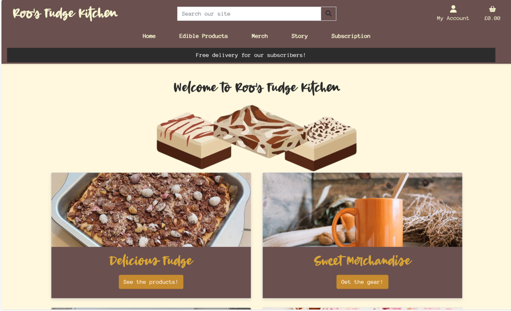  
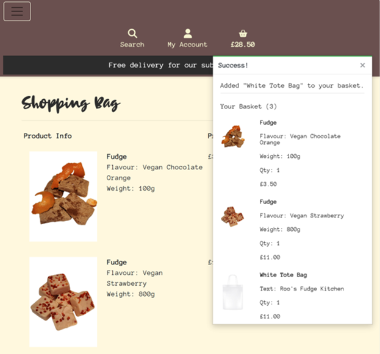  
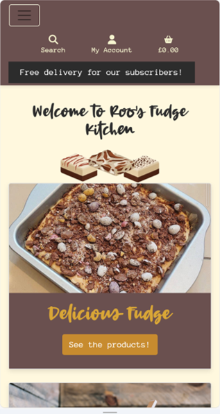  

### Firefox
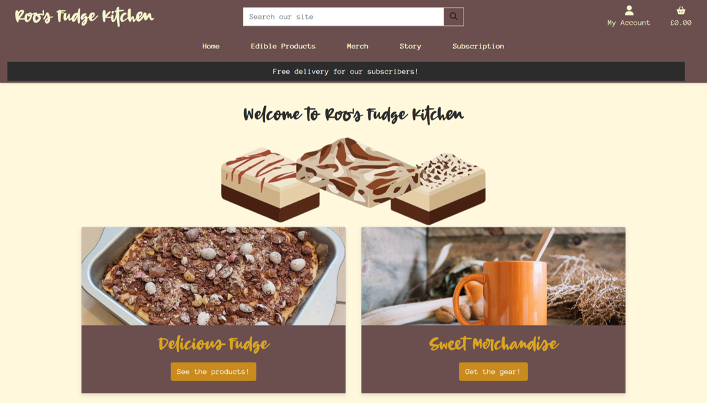  
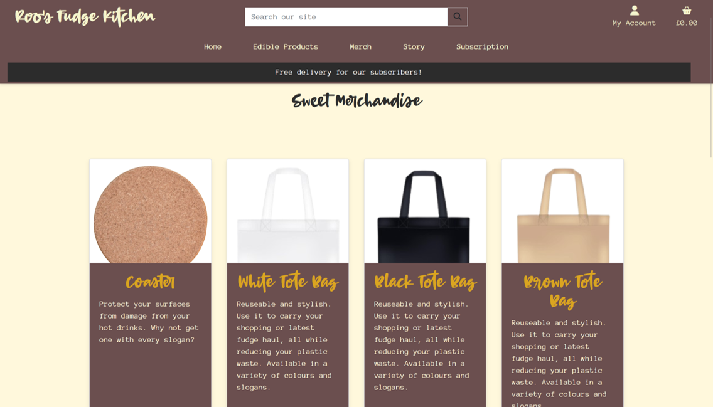  
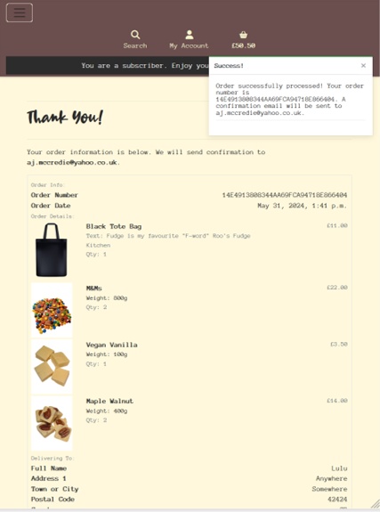  
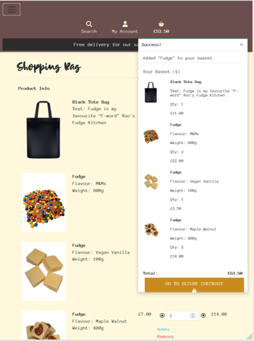  
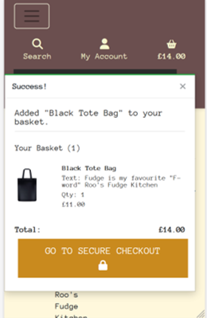  

## Home page
| Test case description  | Expected outcome |  Pass?  | 
| ----------- | ----------- | ----------- |
| User navigation | User can see and access available options | Yes  |

|  HTML  |  CSS  |  JSHint  |  Python Linter  |  Lighthouse |
| ---- | ---- | ---- | ---- | ---- |
| 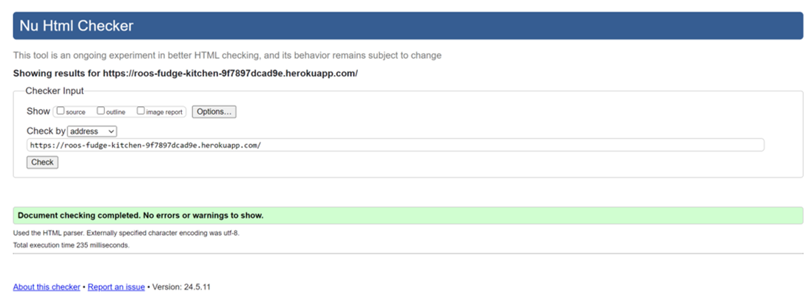 | 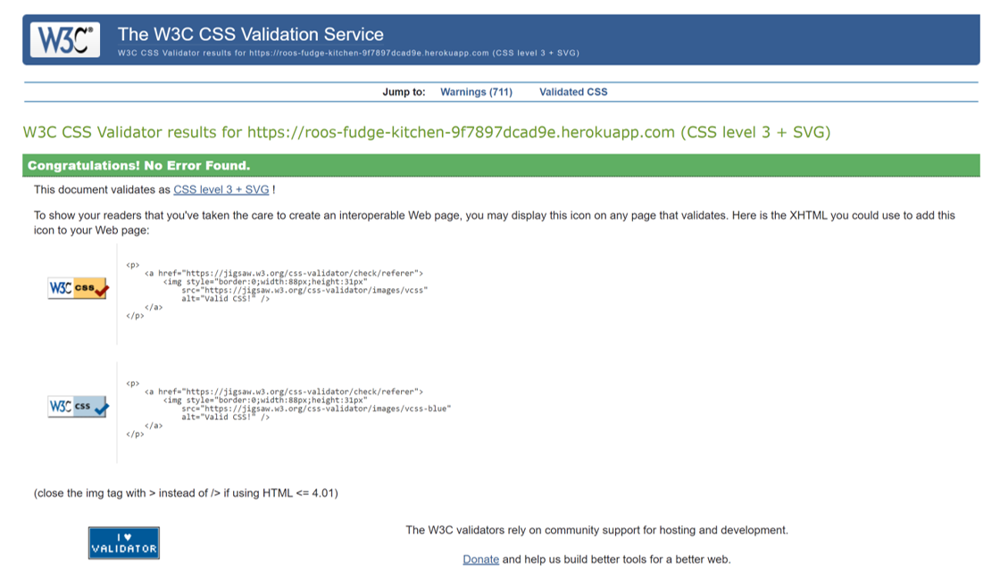 | N/A | No issues | 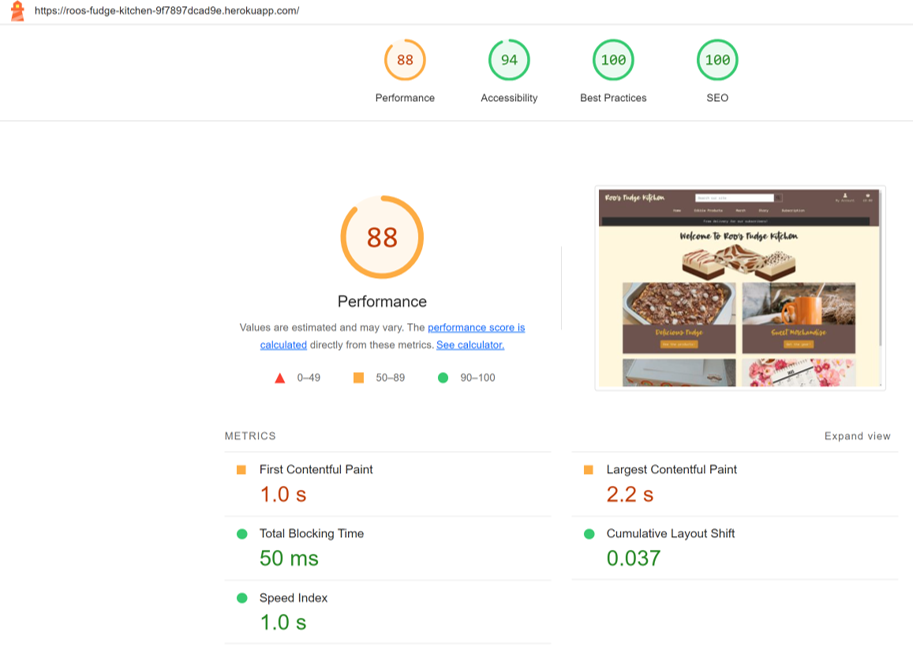 |

#### Main nav menu
| Test case description  | Expected outcome |  Pass?  | 
| ----------- | ----------- | ----------- |
| User navigation | User can access any required part of the site | Yes  |
| User profile access | User can access login or sign up options. Logged in users can access account details. | Yes |
| Basket view and access | Users can see toasts with details, and a running total under their basket in the corner at all times | Yes |

#### Search bar
| Form field  | Blank |  Too long/large  |  Incorrect  | Invalid |
| ----------- | ----------- | ----------- | ----------- | --------|
| Text entry | Results show no results available for " " | Limit kicks in set from the model and no further text accepted. | Spelling mistakes are unlikely to generate zero results. | N/A |

Page returning general search results
|  HTML  |  CSS  |  JSHint  |  Python Linter  |  Lighthouse |
| ---- | ---- | ---- | ---- | ---- |
| 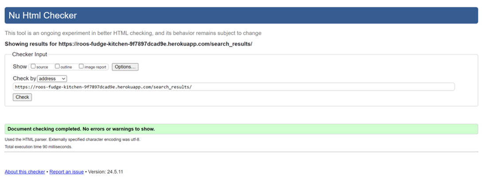 |  | N/A | No issues | 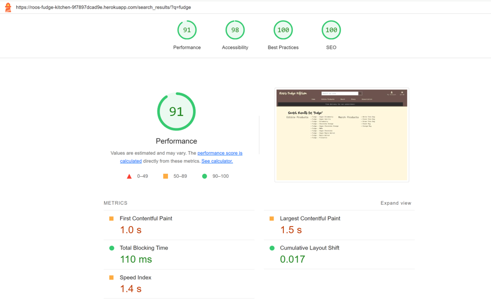  |

#### Other tests of possible user actions
| Action description  | Result acceptable? | 
| ----------- | ----------- |
| Back-up |  Browser back-up in Chrome not supported from this page. |
| Navigating elsewhere |  No issues found |
| Page reload |  Search results maintained |

[Return to Top](#full-details-of-manual-site-testing)

## About us
| Test case description  | Expected outcome |  Pass?  | 
| ----------- | ----------- | ----------- |
| Read story | Story renders on page and can be read | Yes  |
| View images | Images render with the story and can be seen | Yes  |
| Navigate to inquiries and FAQs | Links work and navigate to the expected page | Yes |
| Views FAQs | Each FAQ will drop open when clicked and remain open until clicked again | Yes |
| Non-signed in users cannot access inquiries | This part demands a login or sign-up if the user is not already authenticated | Yes |
| Signed in users can access inquiries | The form and submit button render if the user is authenticated | Yes |
| User feedback on actions | Users receive a confirmation toast when they send an inquiry | Yes |

Our Story
|  HTML  |  CSS  |  JSHint  |  Python Linter  |  Lighthouse |
| ---- | ---- | ---- | ---- | ---- |
| 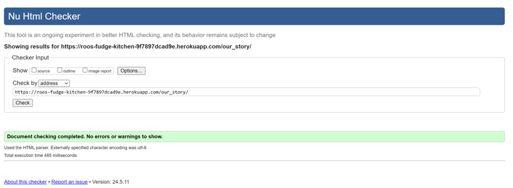 |  | N/A | no issues | 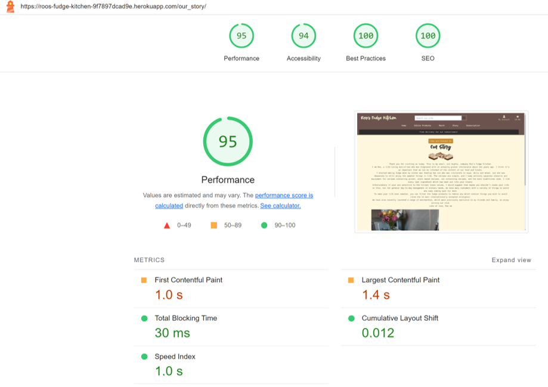 |

FAQs and Contact Us
|  HTML  |  CSS  |  JSHint  |  Python Linter  |  Lighthouse |
| ---- | ---- | ---- | ---- | ---- |
| 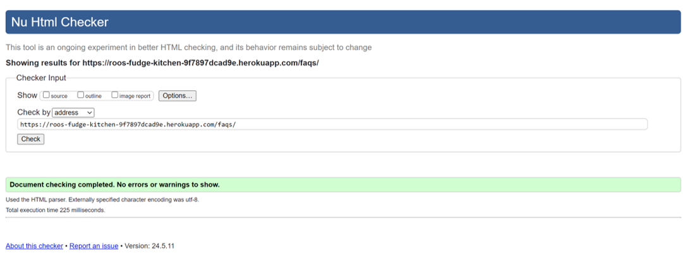 |  | 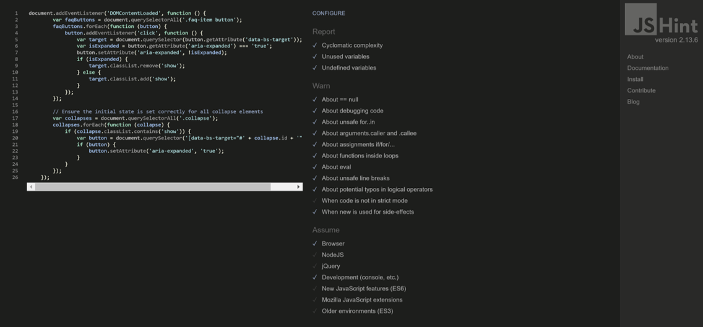 | no issues | 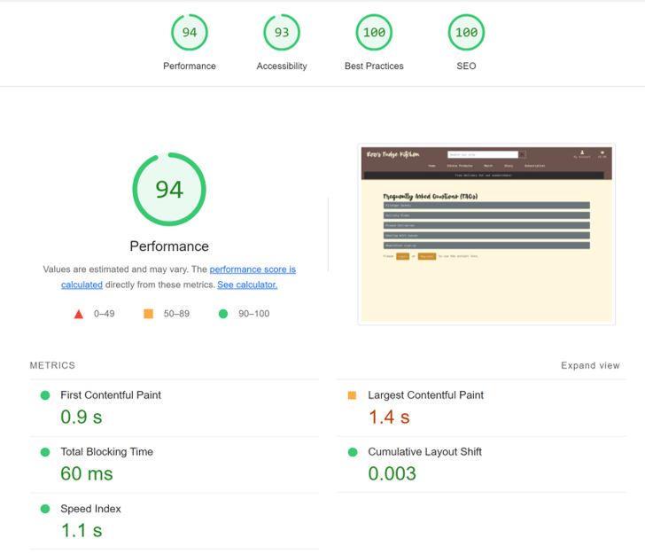 |

#### Restricted pages
| Test case description  | Expected outcome |  Pass?  | 
| ----------- | ----------- | ----------- |
| Only signed-in users access the inquiries form | Users are directed to login or sign-up. A new sign-up will have their email verified. Redirects to page with the form. Logged in users can use the form | Yes  |

#### Other tests of possible user actions
| Action description  | Result acceptable? | 
| ----------- | ----------- |
| Back-up after sending an inquiry results in the inquiry still being sent to the admin | Yes |

[Return to Top](#full-details-of-manual-site-testing)

## Edible Products
| Test case description  | Expected outcome |  Pass?  | 
| ----------- | ----------- | ----------- |
| Display all products | Products display with correct price and images, and link to the correct product details | Yes  |
| Products displayed according to preference | Products can be correctly displayed as 'All', 'Plant-based' or 'Traditional' | Yes |
| Allergen filtering | Products can be filtered on page according to selected allergens, and this can be changed multiple times without issue. | Yes |
| Guest products are identifiable | Guest products are shown with a banner which states they are 'guest products' | Yes |

|  HTML  |  CSS  |  JSHint  |  Python Linter  |  Lighthouse |
| ---- | ---- | ---- | ---- | ---- |
| There is a known error on this page:   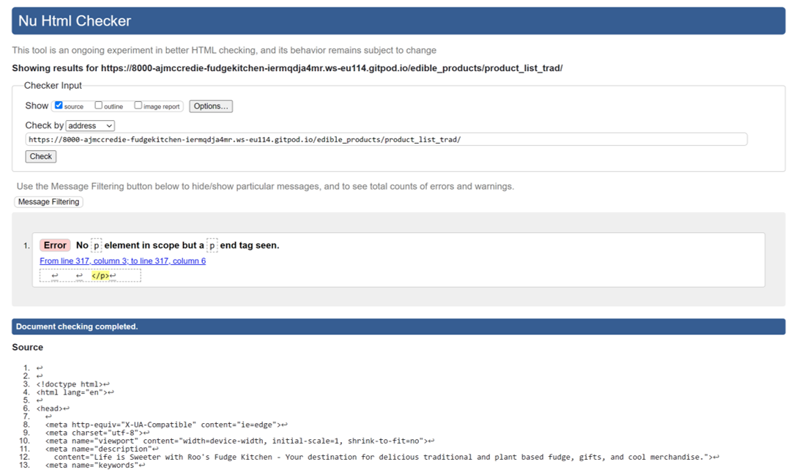 |  | No additional JS | No issues | 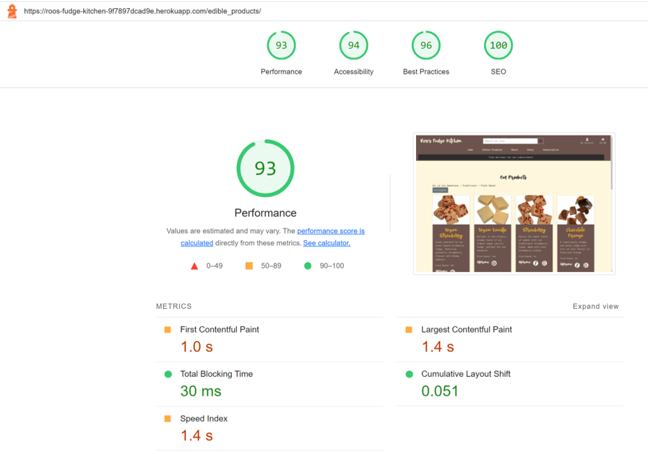 |

#### Edible product detail page
| Test case description  | Expected outcome |  Pass?  | 
| ----------- | ----------- | ----------- |
| Clear details and images of product | User can read the full details and ingredients of the products. The allergens are clearly stated, and it is confirmed whether or not the product is 'Plant Based' | Yes |
| Choice of weights to buy | A drop down list of the available weights and the associated prices of these products are displayed. Whichever one the user selects prior to adding to the basket is reflected accurately in the basket.| Yes |
| Choice of number of products | Users can update the number of products they wish to purchase either using the up and down arrows on the form, or by typing the number into the form field. A maximum of 99 are allowed for a single 'add to basket' | Yes |
| Successful adding to basket feedback | Users are set to the basket page after they add products to it. They can see the products they have added and choose whether to keep shoppping or complete their purchase. The successful adding of the product is also reflected in the toast. | Yes |

|  HTML  |  CSS  |  JSHint  |  Python Linter  |  Lighthouse |
| ---- | ---- | ---- | ---- | ---- |
| 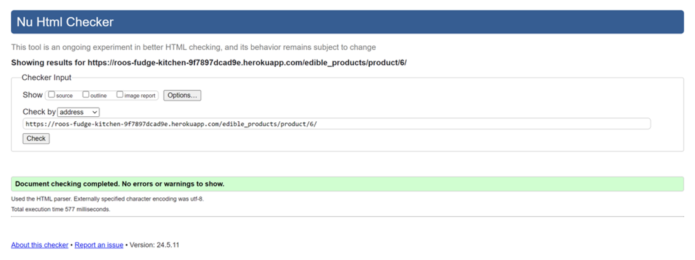 |  | 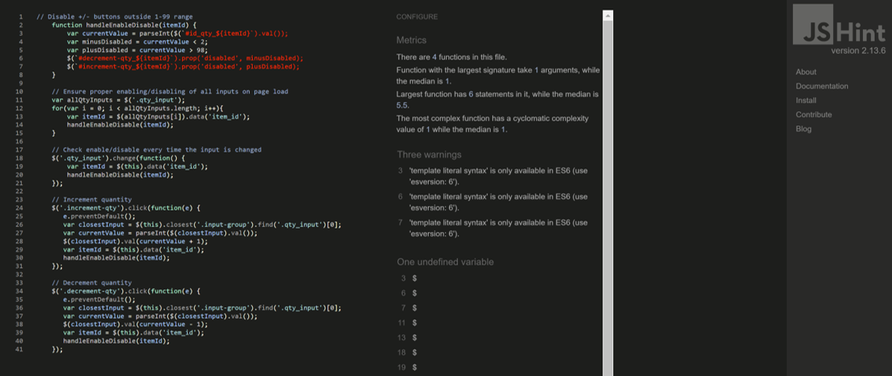 | No issues | 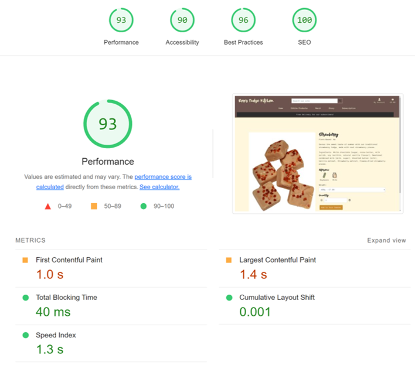  |

| Form field  | Blank |  Too long/large  |  Incorrect  | Invalid |
| ----------- | ----------- | ----------- | ----------- | --------|
| Choice of weight and price | Not possible with drop down - reverts to default| Not possible with drop down - reverts to default | Not possible with drop down - reverts to default | Not possible with drop down - reverts to default |
| Number of products to add | Returns the 500 error on a custom page with a return to site button | Error is shown on the page | Error is shown on the page | Error is shown on the page |

#### Site filtering
| Test case description  | Expected outcome |  Pass?  | 
| ----------- | ----------- | ----------- |
| Users can use search bar | Users can access the search bar in every screen size and enter their search terms | Yes |
| Unsuccessful searches return a polite message | If a user enters a word which does not return a match for any of the products, a polite message is shown | Yes |
| Search covers the product names and details | The search queries the product names and details, returning a list of hyperlinked names to the matching products | Yes |
| Results are ordered and easy to use | The products returned are listed under 'Edible products', 'Merch', and 'Subscription'. | Yes |

#### Other tests of possible user actions
| Action description  | Result acceptable? | 
| ----------- | ----------- |
| Site will search for anything the user types and will return what they typed with any possible results. This means that users can spot accidental typos and potentially understand why their results are not as expected. | Yes |

[Return to Top](#full-details-of-manual-site-testing)

## Merchandise products
| Test case description  | Expected outcome |  Pass?  | 
| ----------- | ----------- | ----------- |
| Product list display | Products display with correct name and image, and are a link to a page with the details for that product | Yes |

|  HTML  |  CSS  |  JSHint  |  Python Linter  |  Lighthouse |
| ---- | ---- | ---- | ---- | ---- |
| 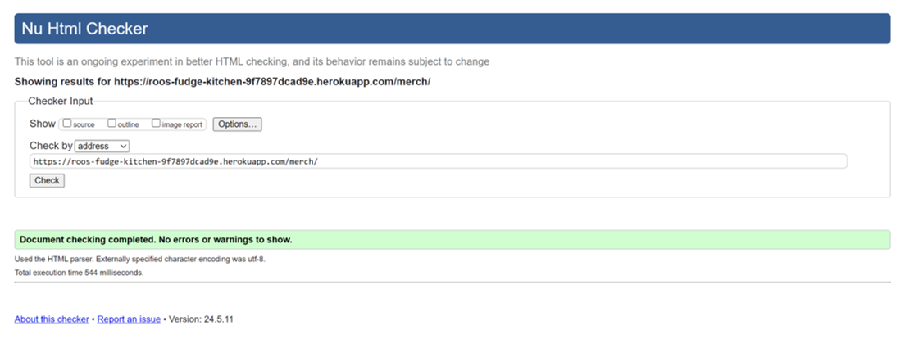 |  | No additional script | No issues | 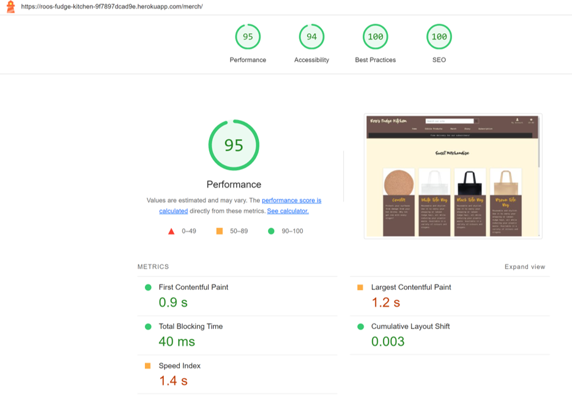 |

#### Merch product detail page
| Test case description  | Expected outcome |  Pass?  | 
| ----------- | ----------- | ----------- |
| Product details display with correct image | The product details display in full with any relevant additional products and the image of the slogan text. | Yes |
| Product selection | Product in volume of 1-99 can be added to basket and appears correctly in toast. | Yes |
| Links to alternative colours | Alternative colours, where available, are displayed and are links to that product detail page instead | Yes |

|  HTML  |  CSS  |  JSHint  |  Python Linter  |  Lighthouse |
| ---- | ---- | ---- | ---- | ---- |
| This shows an error because the src is controlled by logic from Django. A default image was added to try to remove the error, but unsuccessfully. It does not affect the page function.    |  | 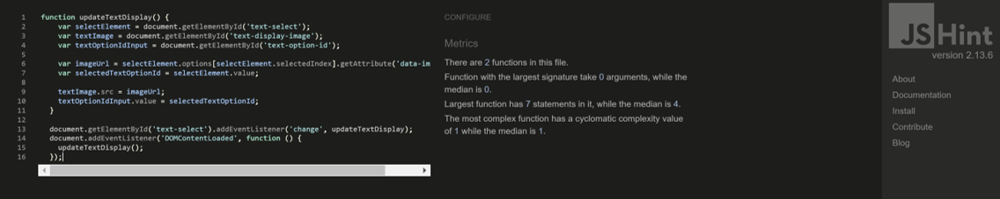 | No issues | 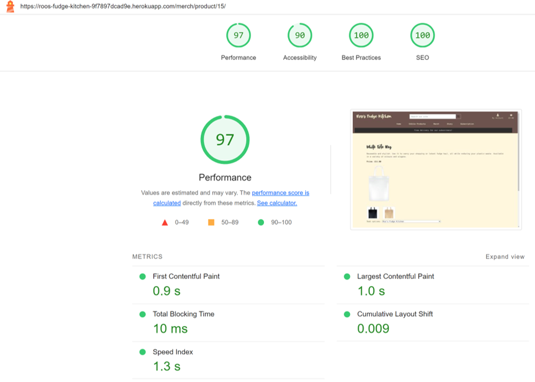 |

| Form field  | Blank |  Too long/large  |  Incorrect  | Invalid |
| ----------- | ----------- | ----------- | ----------- | --------|
| Text choice | Cannot be blank from drop down | Cannot be blank from drop down | Cannot be incorrect from drop down | Cannot be invalid from drop down |
| Number to add to basket | Returns the 500 error on a custom page with a return to site button | Error is shown on the page | Error is shown on the page | Error is shown on the page |

#### Other tests of possible user actions
| Action description  | Result acceptable? | 
| ----------- | ----------- |
| If a user wishes to add more than 99 products, they can do this by adding 99 and then going back to the same product and repeating the process. | Yes |

[Return to Top](#full-details-of-manual-site-testing)

## Accounts pages (including sign-up, sign-in and sign-out)
| Test case description  | Expected outcome |  Pass?  | 
| ----------- | ----------- | ----------- |
| User registration | User can enter details and sign-up for an account. Their email is verified and they cannot proceed without a valid address. | Yes |
| User login | User can enter their details which they used for registration and then gain full access to the customer logged in services.  | Yes |
| User secure logout | User can opt to logout from the site securely | Yes |

|  HTML  |  CSS  |  JSHint  |  Python Linter  |  Lighthouse |
| ---- | ---- | ---- | ---- | ---- |
| These are from AllAuth |  | No additional JS | NOt specifically tested |  |

| Form field  | Blank |  Too long/large  |  Incorrect  | Invalid |
| ----------- | ----------- | ----------- | ----------- | --------|
| Username | Message on screen to fill in | Capped at character limit | You cannot set up an account with the same name as one that already exists in the database | Users are asked to select more approrpriate character |
| Email | Message on screen to fill in | Capped at character limit | You cannot set up an account with the same name as one that already exists in the database | Email confirmation is sent, the account is not successfully created until this verification occurs. |
| Password | Message on screen to fill in | Users are reminded of the valid combinations and rules | Users are reminded of the valid combinations and rules | Users are reminded of the valid combinations and rules |

#### Other tests of possible user actions
| Action description  | Result acceptable? | 
| ----------- | ----------- |
| Backing up from being logged out initially looks like you are still signed in, until user tries to follow any authorised links, where it then directs them to sign-in. | Yes |

#### Basket
| Test case description  | Expected outcome |  Pass?  | 
| ----------- | ----------- | ----------- |
| Subscription status honoured | If a user is already a subscriber, this is reflected in the banner and the removal of the delivery charge. If the subscription product is in the basket for checkout, the same thing happens. | Yes  |
| View all items | All items in the basket plus key additional information are shown | Yes |
| Remove or update the number of items | 'Remove' successfully removes the item and returns to the basket page. The arrows can be used to change the quantity of any item in the basket, 'update' saves this information to the basket and updates the cost. | Yes |
| Grand total can be seen | The grand total is calculated and returned to the user accurately. | Yes |

|  HTML  |  CSS  |  JSHint  |  Python Linter  |  Lighthouse |
| ---- | ---- | ---- | ---- | ---- |
| Two warnings, but function of page is not impacted   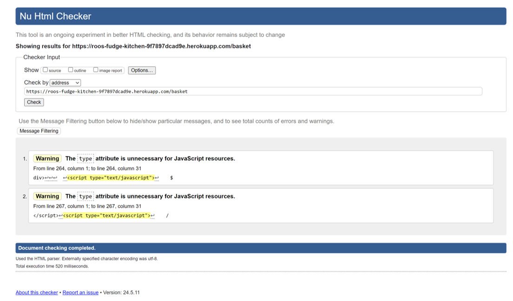 |  | 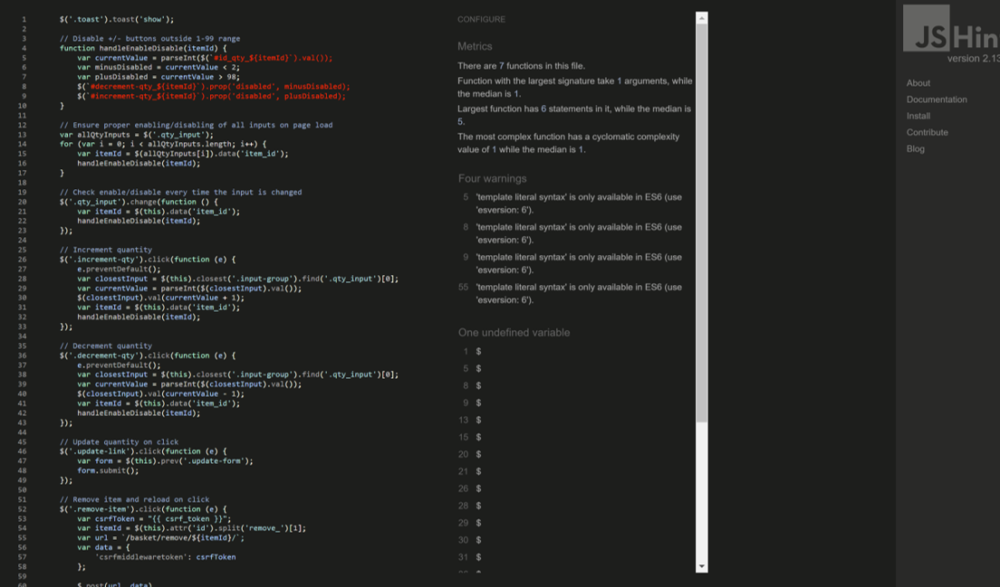 | One variable in a 'try/except' statement showing as unused. | The basket can only be checked as empty:   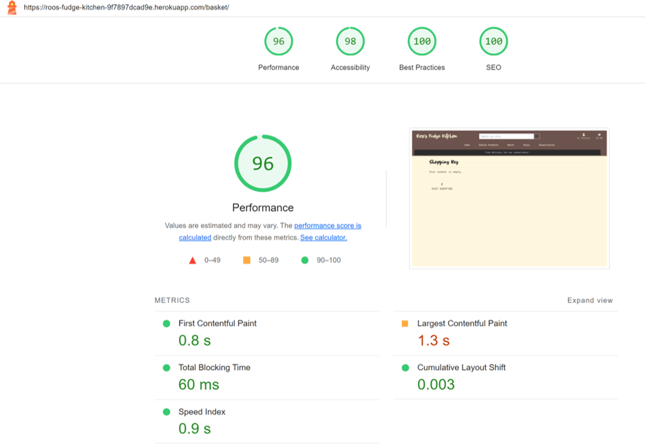 |

| Form field  | Blank |  Too long/large  |  Incorrect  | Invalid |
| ----------- | ----------- | ----------- | ----------- | --------|
| Number of products | Custom 500 page shown, returning to the homepage with basket in tact | Caps at 99 on proceed | Will not accept letters | Will not accept letters |
| Update | Custom 500 page show, returning to the homepage with basket in tactn | Caps at 99 on proceed | Custom 500 page shown, returning to the homepage with basket in tact | No change to the field results in no change on upadte |
| Remove | No effect | No effect | Accidental removal allowed | Not applicable |
| Increment up/down | No possible for this element | Will not go below 0 or above 99 | Will not go below 0 or above 99 | Will not go below 0 or above 99 |

#### Other tests of possible user actions
| Action description  | Result acceptable? | 
| ----------- | ----------- |
| Adding multiple increments of 99 products to basket | These products are all added, although this might prove difficult for the business, all products are charged for, so fulfilling the order might actually be lucrative. Result is acceptable.  |
| User empties all items from basket | Empty basket with the option to 'Keep shopping' returned. Result acceptable.  |

#### Checkout
| Test case description  | Expected outcome |  Pass?  | 
| ----------- | ----------- | ----------- |
| User can view their products | Products and details display, with the option to return to the basket if anything is incorrect | Yes  |
| Subscription status honoured | If a user is already a subscriber, this is reflected in the banner and the removal of the delivery charge. If the subscription product is in the basket for checkout, the same thing happens. | Yes  |
| Update address as required | All fields can be altered with the exception of the email address | Yes |
| Complete checkout | Customer can checkout, receive a confirmation toast and a confirmation email on click (if all form fields are valid) | Yes |

|  HTML  |  CSS  |  JSHint  |  Python Linter  |  Lighthouse |
| ---- | ---- | ---- | ---- | ---- |
| Cannot be checked because login protected |  | Some errors of unused variables, largely taken through walkthrough code.   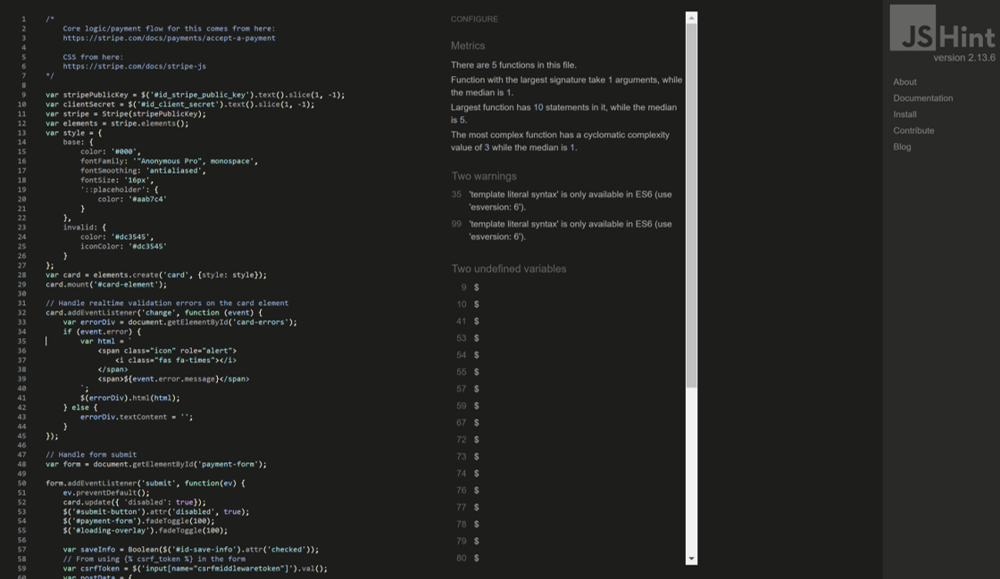 | One line in the models and three in the webhook_handler exceed the character limit of 79 (the worst being 85 characters). | Cannot be checked because login protected |

| Form field  | Blank |  Too long/large  |  Incorrect  | Invalid |
| ----------- | ----------- | ----------- | ----------- | --------|
| Name | User prompted to enter | No further input allowed after charcter limit | Wrong name will be sent on order | Wrong name will be sent on order |
| Email | Cannot be deleted | Cannot be changed | Cannot be changed | Was verified on sign-up |
| Address Line 1 | User prompted to enter | No further input allowed after charcter limit | Wrong name will be sent on order. Depending on the error, it may or may not reach the destination, but the site cannot know if the address is valid or correct | Wrong name will be sent on order. Depending on the error, it may or may not reach the destination, but the site cannot know if the address is valid or correct |
| Address Line 2 (optional) | Order proceeds without issue | No further input allowed after charcter limit | No issue | No issue |
| Town/City | User prompted to enter | No further input allowed after charcter limit | Wrong name will be sent on order. Depending on the error, it may or may not reach the destination, but the site cannot know if the address is valid or correct | Wrong name will be sent on order. Depending on the error, it may or may not reach the destination, but the site cannot know if the address is valid or correct |
| County (optional) | Order proceeds without issue | No further input allowed after charcter limit | No issue | No issue |
| Country | User prompted to enter | No further input allowed after charcter limit | Drop down menu, so cannot be incorrect | Wrong country may be selected. If the rest of the address is correct, it shouldn't cause too much issue |
| Post code | Payment proceeds so long as it is entered in the Stripe element | No further input allowed after the character limit | The Stripe element will override |  The Stripe element will override |
| Stripe Payment | Tries to complete the payment, but returns to checkout page with message of card number being incomplete | Will not accept more digits | Returns to the checkout page with errors visible under the Stripe element | Returns to the checkout page with errors visible under the Stripe element |

The Stripe payments were tested using their set of test numbers. It was also confirmed that after the user received their error warning that they were then able to complete a purchase as planned with a correct number.
**Stripe Test Codes**
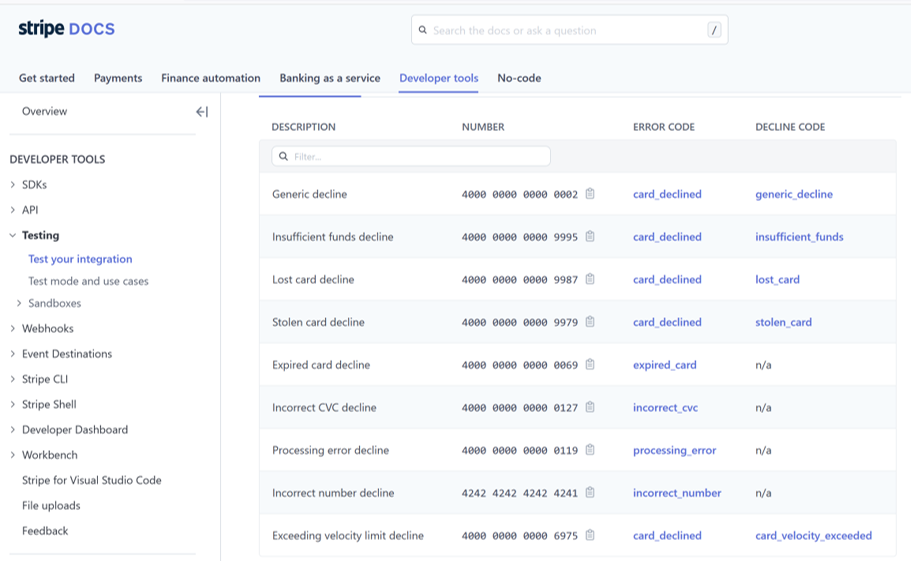
 

**Declined**
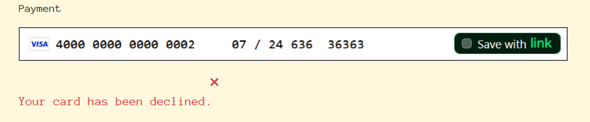
 

**Expired**
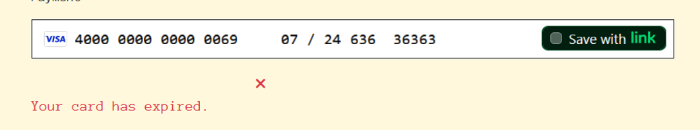
 

**Invalid**
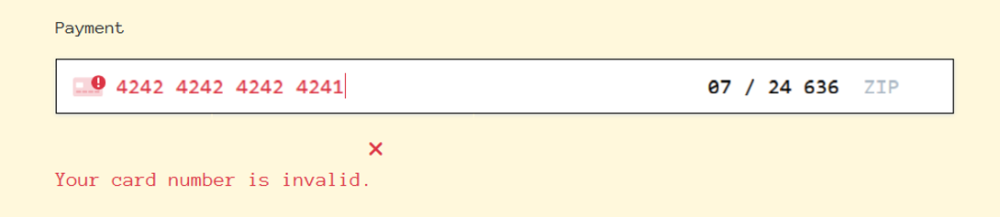

#### Other tests of possible user actions
| Action description  | Result acceptable? | 
| ----------- | ----------- |
| Back-up returns to basket | Yes |
| Change page from a link will return to checkout on 'back-up'. Basket remains in tact and available. | Yes |
| Change page from the page address bar returns to the checkout with the information as it was left | Yes |

## Subscriptions page
| Test case description  | Expected outcome |  Pass?  | 
| ----------- | ----------- | ----------- |
| View non-restricted content when not registered/logged in | Page suggests login |  Yes |
| Access to restricted content after logging in | Page content changes to show the login | Yes |
| Unable to subscribe twice | Page content changes to tell the user they are subscribed already | Yes |

|  HTML  |  CSS  |  JSHint  |  Python Linter  |  Lighthouse |
| ---- | ---- | ---- | ---- | ---- |
| 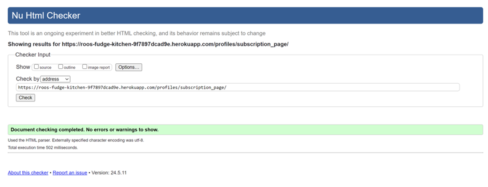 |  | No additional JS | No issues |  |

#### Other tests of possible user actions
| Action description  | Result acceptable? | 
| ----------- | ----------- |
| Attempt to register the same email address twice results in a warning on the screen that the address is already in use | Yes |
| Customer attempts to add two subscriptions to the same basket will cause an error message to display in the toast that there cannot be more than one of these items in the basket. | Yes |

## Admin dashboard features
| Test case description  | Expected outcome |  Pass?  | 
| ----------- | ----------- | ----------- |
| Store manager can navigate the Store Management pages | Full list of available features shown categorised on the main dashboard | Yes |
| Store manager can access the Store Management pages | Each category acts as a link to the sub category with further options | Yes |

|  HTML  |  CSS  |  JSHint  |  Python Linter  |  Lighthouse |
| ---- | ---- | ---- | ---- | ---- |
| Unable to test due to password protection |  | No additional JS | No issues | Not available for logged in pages |

### CRUD of Edible Products
| Test case description  | Expected outcome |  Pass?  | 
| ----------- | ----------- | ----------- |
| Admin access detailed list of all edible products | Full list of edible products can be seen with images and options for actions | Yes |
| Admin create product | A new product can be created by filling in the form and will appear on the customer front end | Yes |
| Admin can delete product from the top list | A product can be deleted and will disappear from the customer front end. This action is checked with a message first. | Yes |
| Admin edit product | Store manager can make quick changes, save the form and it appears on the customer front end | Yes |
| Changes immediately active on site | Any changes on the Store Management are immediately reflected on the customer front end | Yes |

|  HTML  |  CSS  |  JSHint  |  Python Linter  |  Lighthouse |
| ---- | ---- | ---- | ---- | ---- |
| Unable to test due to password protection |  | No additional JS | No issues | Not available for logged in pages |

| Form field  | Blank |  Too long/large  |  Incorrect  | Invalid |
| ----------- | ----------- | ----------- | ----------- | --------|
| Name |  | Caps at limit | This would be allowed and then down to the Store Manager to find the typo | Numbers are allowed. This would also need to be caught by the Store Management |
| Flavour | Form error shows on page | Caps at limit | This would be allowed and then down to the Store Manager to find the typo | Numbers are allowed. This would also need to be caught by the Store Management |
| Description | Form error shows on page | Caps at limit | This would be allowed and then down to the Store Manager to find the typo | Numbers are allowed. This would also need to be caught by the Store Management |
| Ingredients | Form error shows on page | Caps at limit | This would be allowed and then down to the Store Manager to find the typo | Numbers are allowed. This would also need to be caught by the Store Management |
| Image | Form accepts blank, but the top level list then shows that it requires filling in. | Image quality cap seems to be fairly high | This would need to be caught by store management | Invalid image types are disallowed |
| Allergen tick boxes | No issue | N/A | Needs to be caught by management | N/A |
| Plant based tick boxes | No issue | N/A | Needs to be caught by management | N/A |
| Weight over-rides |  |  |  |  |

### CRUD of Merch Products
| Test case description  | Expected outcome |  Pass?  | 
| ----------- | ----------- | ----------- |
| Admin access detailed list of all merch products | Full list of merch products can be seen with images and options for actions | Yes |
| Admin create product | A new product can be created by filling in the form and will appear on the customer front end | Yes |
| Admin can delete product from the top list | A product can be deleted and will disappear from the customer front end | Yes |
| Admin edit product | Store manager can make quick changes, save the form and it appears on the customer front end | Yes |
| Changes immediately active on site | Any changes on the Store Management are immediately reflected on the customer front end | Yes |

|  HTML  |  CSS  |  JSHint  |  Python Linter  |  Lighthouse |
| ---- | ---- | ---- | ---- | ---- |
| Unable to test due to password protection |  | No additional JS | No issues | Not available for logged in pages |

| Form field  | Blank |  Too long/large  |  Incorrect  | Invalid |
| ----------- | ----------- | ----------- | ----------- | --------|
| Name |  |  |  |  |
| Description |  |  |  |  |
| Price |  |  |  | Only accepts numbers |
| Type | Form error shown on page |  |  |  |
| Colour |  |  |  |  |
| Image |  | Resolution of image can be too high and shows as a form error |  |  |
| Colour variations (name) |  |  |  |  |
| Colour variations (image) |  |  |  |  |
| Colour variations (product url) |  |  |  |  |
| Colour variations (delete) | N/A | N/A | Deleted links disappear on save. This is not checked | N/A |
| Text options (text) |  |  |  |  |
| Text options (image) |  |  | Anything can be added. Store Manager needs to check |  |
| Text options (delete) |  |  | Deleted options disappear on save. This is not checked |  |

### Tracking of orders
| Test case description  | Expected outcome |  Pass?  | 
| ----------- | ----------- | ----------- |
| List of orders can be seen | Full list of orders can be seen in chronological order | Yes |
| Full details available | Each item on the list acts as a link to the details of the order  | Yes |
| Orders clearly marked as 'made' and 'dispatched' as appropriate | Tags are shown and can be toggled. Orders marked as dispatched appear 'greyed-out' compared to the other items | Yes |
| Orders can be sorted appropriately | Orders can be filtered by type and whether requiring dispatch | Yes |

|  HTML  |  CSS  |  JSHint  |  Python Linter  |  Lighthouse |
| ---- | ---- | ---- | ---- | ---- |
| Unable to test due to password protection |  | No additional JS | No issues | Not available for logged in pages |

| Form field  | Blank |  Too long/large  |  Incorrect  | Invalid |
| ----------- | ----------- | ----------- | ----------- | --------|
| Toggle as made | N/A | N/A |  | N/A |
| Toggle as dispatched | N/A | N/A |  | N/A |
| Mark as deleted | N/A | N/A | Removes from the list and from the 'orders' in the user's profile too. | N/A |

### Receiving and checking off inquiries
| Test case description  | Expected outcome |  Pass?  | 
| ----------- | ----------- | ----------- |
| Admin receive the messages | Messages sent from users appear in the dashboard list | Yes  |
| Admin can choose act on message |  |  |
| Admin can mark images as dealt with |  |  |

|  HTML  |  CSS  |  JSHint  |  Python Linter  |  Lighthouse |
| ---- | ---- | ---- | ---- | ---- |
| Unable to test due to password protection |  | No additional JS | No issues | Not available for logged in pages |

| Form field  | Blank |  Too long/large  |  Incorrect  | Invalid |
| ----------- | ----------- | ----------- | ----------- | --------|
|  |  |  |  |  |

### Subscription Management

#### Other tests of possible user actions
| Action description  | Result acceptable? | 
| ----------- | ----------- |
| Back-up from page |   |
| Refresh page |   |

Click [here](README.md) to return to the README.md